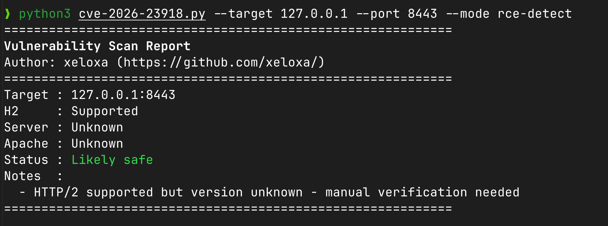

# CVE-2026-23918-Apache-H2-PoC

This is a proof-of-concept exploit for the double-free vulnerability in Apache's `mod_http2` (CVE-2026-23918). It's a nasty bug that hits the `h2_mplx.c` stream cleanup path.

Basically, if you time it right, you can get the server to try and clean up the same stream twice, which usually leads to a SIGSEGV and a worker crash.


---

## Legal Stuff
Don't be stupid. Use this for authorized testing only. If you use it on something you don't own, you're on your own. I'm not responsible for what you do with it.

---

## What's going on?
CVE-2026-23918 affects Apache 2.4.66. It was patched in 2.4.67 earlier this month (May 2026). 

It's a race condition in how Apache handles early RST_STREAM frames. If a client sends a HEADERS frame and immediately follows it with an RST_STREAM before the multiplexer even registers the stream, two different callbacks try to clean up. 

One callback handles the reset, the other handles the stream closure. Both call `m_stream_cleanup()`, which pushes the same pointer onto the cleanup array. When Apache eventually tries to destroy those streams, the second attempt hits already-freed memory.

### Impact
- **DoS**: Extremely easy. One connection can crash workers. Since Apache respawns them, you can keep the server under constant pressure with very little bandwidth. This is what this PoC demonstrates - and it's been tested and confirmed working on Apache 2.4.66.
- **RCE**: Theoretically possible but **not practical for most attackers**. It requires:
  1. An **info leak** (a second vulnerability to leak memory addresses)
  2. A specific APR memory allocator (`mmap`, default on Debian/Ubuntu/Docker)
  3. Precise heap manipulation and knowledge of the target's memory layout
  
  No public RCE exploit exists, and building one is a non-trivial engineering effort. The real-world impact for most orgs is reliable DoS, not RCE.

  

---

## Getting Started

You'll need Python 3.9+ and the `h2` library.

```bash
git clone https://github.com/xeloxa/CVE-2026-23918-Apache-H2-PoC.git
cd CVE-2026-23918-Apache-H2-PoC
pip install -r requirements.txt
```

### Quick Tests

**Crashing a local lab:**
```bash
# Aggressive DoS
python3 cve-2026-23918.py --target 127.0.0.1 --port 8443 --mode dos
```

**Checking if a target might be vulnerable:**
```bash
# This is passive, it just checks headers and H2 support
python3 cve-2026-23918.py --target example.com --mode rce-detect
```

**Sustained pressure:**
```bash
# Low bandwidth, long duration
python3 cve-2026-23918.py --target 10.0.0.50 --mode slow-drip -d 60
```

---

## How to fix it
If you're running 2.4.66, you need to move to 2.4.67. 

If you can't update right now, you can disable HTTP/2 by adding `Protocols http/1.1` to your config (or just remove `h2` from the list). It's not ideal for performance, but it stops the crash.

---

## Notes & References
- [Official Apache Advisory](https://httpd.apache.org/security/vulnerabilities_24.html)
- [NVD Link](https://nvd.nist.gov/vuln/detail/CVE-2026-23918)
- Discovered by Bartłomiej Dmitruk and Stanisław Strzałkowski. 

I've tested this on a few different Debian and Ubuntu builds. The DoS is very reliable. RCE is a lot more "finicky" and I wouldn't count on it in a real-world scenario unless the target has a very predictable heap state.